# 📖 The FizzBuzz Challenge Rules

*Understanding what you're going to build (without spoiling the fun!)*

## 🎯 The Mission

You're going to create a function called `fizzbuzz` that takes a number and returns a string following some special rules. Think of it as a number transformation game!

## 🎮 The Rules

```mermaid
flowchart TD
    A["🔢 Input: Any number"] --> B{"What should<br/>we output?"}
    B --> C["📝 Follow the<br/>FizzBuzz Rules"]
    C --> D["📤 Output: A string"]
```



### The Basic Rules

**For any number you give it:**

1. **If the number is divisible by 3** → return `"Fizz"`
2. **If the number is divisible by 5** → return `"Buzz"`  
3. **If the number is divisible by BOTH 3 and 5** → return `"FizzBuzz"`
4. **For any other number** → return the number as a string

## 🧩 Let's Explore Some Examples

**Can you spot the pattern here?**

| Input | Output | Why? |
|-------|--------|------|
| 1 | "1" | Not divisible by 3 or 5 |
| 2 | "2" | Not divisible by 3 or 5 |
| 3 | "Fizz" | Divisible by 3 |
| 4 | "4" | Not divisible by 3 or 5 |
| 5 | "Buzz" | Divisible by 5 |
| 6 | "Fizz" | Divisible by 3 |
| 7 | "7" | Not divisible by 3 or 5 |
| 8 | "8" | Not divisible by 3 or 5 |
| 9 | "Fizz" | Divisible by 3 |
| 10 | "Buzz" | Divisible by 5 |
| 11 | "11" | Not divisible by 3 or 5 |
| 12 | "Fizz" | Divisible by 3 |
| 13 | "13" | Not divisible by 3 or 5 |
| 14 | "14" | Not divisible by 3 or 5 |
| 15 | "FizzBuzz" | Divisible by BOTH 3 and 5! |

## 🤔 Think About It

Before we start coding, take a moment to think about these questions:

**Pattern Recognition:**
- What do all the "Fizz" numbers have in common?
- What do all the "Buzz" numbers have in common?  
- When do you get "FizzBuzz"?

**Logic Questions:**
- How would you check if a number is divisible by 3?
- How would you check if a number is divisible by 5?
- What should you check first - individual conditions or the combination?

**Implementation Thinking:**
- What kind of structure would you use? (Hint: conditional statements)
- How many different cases do you need to handle?

## 🔍 The Divisibility Reminder

**Quick refresher:** A number is divisible by another number if there's no remainder when you divide them.

- `6 ÷ 3 = 2` remainder `0` → 6 is divisible by 3
- `7 ÷ 3 = 2` remainder `1` → 7 is NOT divisible by 3

**In programming:** We use the **modulo operator** `%` to find the remainder:
- `6 % 3 = 0` (no remainder)
- `7 % 3 = 1` (remainder of 1)

## 🎯 Your Function Signature

Your function will look like this:

```javascript
function fizzbuzz(number) {
  // Your implementation goes here
  // Should return a string
}
```

**Input:** A number (like `3`, `15`, `7`)  
**Output:** A string (like `"Fizz"`, `"FizzBuzz"`, `"7"`)

## 🧪 What Success Looks Like

When your function is complete, you should be able to call it like this:

```javascript
fizzbuzz(1)   // returns "1"
fizzbuzz(3)   // returns "Fizz"
fizzbuzz(5)   // returns "Buzz"
fizzbuzz(15)  // returns "FizzBuzz"
```

## 🤓 Why FizzBuzz?

**Historical note:** FizzBuzz is a classic programming interview question because it tests:
- Basic conditional logic
- Understanding of the modulo operator
- Attention to edge cases (like the "both 3 and 5" rule)
- Clear thinking under pressure

**For learning:** It's perfect because:
- Rules are simple to understand
- Implementation has some tricky parts to think through
- Great size for practicing TDD
- Immediate feedback when you get it right

## 🎨 The Creative Part

Once you get the basic function working, we'll connect it to a beautiful web interface where you can:
- See your FizzBuzz sequence in action
- Customize colors and animations
- Show it off to friends and family!

## 🚀 Ready to Code?

**Before you start coding, make sure you understand:**
- ✅ What input your function receives (a number)
- ✅ What output it should return (a string)
- ✅ The four different cases to handle
- ✅ When to return "FizzBuzz" vs "Fizz" vs "Buzz"

**Think you've got it?** Let's set up your development environment!

## 🧠 One Last Thought Challenge

**Here's a tricky question to ponder:** 

If you write your conditional statements in the wrong order, you might get incorrect results. For example, what would happen if you checked "divisible by 3" before checking "divisible by both 3 and 5"?

Think about this as you implement - order matters! 🤔

---

**📁 Quick Navigation:**
- ⬅️ **Previous:** [START_HERE.md](START_HERE.md)
- ➡️ **Next:** [SETUP_GUIDE.md](SETUP_GUIDE.md)  
- 🆘 **Need help?** Check [help/javascript-concepts.md](help/javascript-concepts.md) for JavaScript syntax

---

**[Next: Set Up Your Development Environment →](SETUP_GUIDE.md)**

---

> *"Understanding the problem is half the solution."*

**Great job thinking through the rules, Alexandra!** Now let's get your coding environment ready to build this! 🚀✨