# 🌟 Welcome to Your FizzBuzz Adventure, Alexandra!

*Your personal guide to mastering Test-Driven Development through a fun coding challenge*

## 🎯 What You're About to Build

You're going to create a **FizzBuzz function** - a classic programming exercise that's both simple to understand and surprisingly powerful for learning professional development skills. By the end of this journey, you'll have:

✨ **A working FizzBuzz function** built using industry-standard practices  
🧪 **Your first Test-Driven Development experience**  
🌐 **A beautiful web interface** showing off your creation  
💪 **Confidence in JavaScript and professional tools**  

## 🎮 What Makes This Special?

This isn't just a coding exercise - it's your introduction to how professional developers actually work:

- **Test-Driven Development (TDD)** - Write tests first, then make them pass
- **Professional Tools** - Use the same tools companies like Google and Netflix use  
- **Git Workflow** - Save your progress like a pro
- **Clean Code** - Write code that other developers will admire

## 🤔 What You Already Know (That's Perfect!)

Since you have programming experience from school, you already understand:
- Variables and functions
- Conditional statements (if/else)
- Basic logic and problem-solving

**Perfect!** That's exactly what you need. We'll teach you the JavaScript syntax and professional practices along the way.

## ⏱️ How Long Will This Take?

**Total Time:** About 45-60 minutes, broken into bite-sized steps:
- 📖 Understanding the challenge: 5 minutes
- 🛠️ Setting up your tools: 10 minutes  
- 🧪 Learning TDD basics: 10 minutes
- ⚔️ Building your solution: 20-25 minutes
- 🎨 Making it beautiful: 10 minutes

**Take breaks whenever you want!** This is your journey to enjoy.

## 🚀 Your Learning Journey

Here's your path to FizzBuzz mastery:

```mermaid
flowchart TD
    A["🌟 START HERE<br/>(You are here!)"] --> B["📖 KATA RULES<br/>Learn what you're building"]
    B --> C["🛠️ SETUP GUIDE<br/>Get your tools ready"]
    C --> D["🧪 TDD BASICS<br/>Learn the testing mindset"]
    D --> E["⚔️ KATA JOURNEY<br/>Build your solution step-by-step"]
    E --> F["🎨 MAKE IT SHINE<br/>Create a beautiful web interface"]
    F --> G["🎉 CELEBRATION<br/>You did it!"]
    
    style A fill:#fff3e0
    style G fill:#c8e6c9
```

## 🆘 Need Help Along the Way?

I've created some helpful references you can check anytime:

- **[help/javascript-concepts.md](help/javascript-concepts.md)** - JavaScript syntax you'll encounter
- **[help/tdd-concepts.md](help/tdd-concepts.md)** - Deeper understanding of TDD
- **[help/tools-explained.md](help/tools-explained.md)** - What all these tools do
- **[help/troubleshooting.md](help/troubleshooting.md)** - When things go wrong

## 💭 What's Different About This Approach?

Instead of just showing you the solution, I'm going to **guide you to discover it yourself**. You'll get:

- **Guiding questions** that help you think through the problem
- **Hints** when you're stuck, not answers
- **Clear explanations** of concepts when you first encounter them
- **Encouragement** every step of the way

## 🎨 Alexandra's Creative Touch

This project is set up especially for you! As you go through it, you'll be able to:
- Choose your own color schemes
- Add your personal style to the interface  
- Make it uniquely yours to show friends and family

## 🤝 Professional Skills You'll Learn

By the end of this kata, you'll understand:

**Test-Driven Development:**
- Why write tests before code?
- How tests guide your development
- The Red-Green-Refactor cycle

**JavaScript Essentials:**
- Functions and modules
- Conditional logic
- Working with strings and numbers

**Professional Tools:**
- Jest for testing
- VS Code for development
- Git for version control
- ESLint and Prettier for code quality

**Problem-Solving Approach:**
- Breaking down complex problems
- Thinking step by step
- Building confidence through small wins

## 🌟 Ready to Begin?

**Remember:** Every expert developer has built FizzBuzz. You're joining a community of millions of programmers who started exactly where you are now.

**Your mindset for success:**
- 🤔 **Be curious** - Ask "why?" and "how?"
- 🐛 **Embrace mistakes** - They're how we learn
- 🎯 **Focus on the process** - Not just the end result
- 🎉 **Celebrate small wins** - Every passing test is progress

## 🚀 Let's Go!

**Your first step:** Understand exactly what you're going to build.

**[Next: Learn the Kata Rules →](KATA_RULES.md)**

---

> *"The expert in anything was once a beginner."* - Helen Hayes

**Alexandra, you've got this!** Every line of code you write is making you a better developer. Let's build something amazing together! 💪✨

---

**📁 Quick Navigation:**
- 🏠 **You are here:** START_HERE.md
- ➡️ **Next:** [KATA_RULES.md](KATA_RULES.md)
- 📚 **Help:** [help/](help/) folder for reference materials