# 🧪 TDD Basics - Your New Superpower

*Learn the testing mindset that will guide your FizzBuzz implementation (10 minutes)*

## 🎯 What is Test-Driven Development?

**TDD** (Test-Driven Development) is like having a GPS for coding. Instead of wandering around hoping you'll reach your destination, you get clear directions every step of the way.

**The basic idea:** Write tests BEFORE you write code. The tests tell you exactly what to build.

## 🤔 Wait, Write Tests First? That Seems Backwards!

**I know, right?** It feels weird at first, but here's why it's amazing:

**Traditional approach:**
1. Write code
2. Hope it works  
3. Test it manually
4. Fix bugs
5. Repeat forever 😵

**TDD approach:**
1. Write a test describing what you want
2. Watch it fail (because you haven't built it yet)
3. Write just enough code to make it pass
4. Clean up your code
5. Move to the next feature ✨

## 🔄 The TDD Cycle: Red-Green-Refactor

```mermaid
flowchart LR
    A["🔴 RED<br/>Write a failing test"] --> B["🟢 GREEN<br/>Make it pass"]
    B --> C["🔵 REFACTOR<br/>Clean up"]
    C --> D["💾 COMMIT<br/>Save progress"]
    D --> A
    
    style A fill:#ffebee,color:#c62828
    style B fill:#e8f5e8,color:#2e7d32
    style C fill:#e3f2fd,color:#1565c0
    style D fill:#fff3e0,color:#ef6c00
```



### 🔴 Red Phase: "What do I want to build?"
- Write a test that describes the behavior you want
- Run it and watch it fail (that's good!)
- The failure tells you exactly what to build next

### 🟢 Green Phase: "Make it work!"  
- Write the simplest code possible to make the test pass
- Don't worry about perfect code yet - just make it work
- The test will tell you when you're done

### 🔵 Refactor Phase: "Make it beautiful!"
- Clean up your code structure without changing functionality
- Make it more readable, maintainable, and elegant
- The tests protect you - if you break something, you'll know immediately
- **Learn more:** [Complete Refactoring Guide](help/refactoring-guide.md)

## 🎮 TDD Applied to FizzBuzz

**Let's see how this works with a simple example:**

### 🔴 Red: Write a failing test
```javascript
test('returns "1" when given 1', () => {
  expect(fizzbuzz(1)).toBe('1');
});
```

**Run it:** `npm test`  
**Result:** ❌ Error: "fizzbuzz is not defined"  
**Perfect!** The test tells us exactly what to build.

### 🟢 Green: Make it pass
```javascript
function fizzbuzz(number) {
  return '1';  // Simplest thing that works!
}
module.exports = fizzbuzz;
```

**Run it:** `npm test`  
**Result:** ✅ Test passes!

### 🔵 Refactor: Can we improve it?
For now, this is fine! We'll improve it when we add more tests.

## 🧠 The TDD Mindset

**Think like this:**
- "What's the simplest test I can write?"
- "What's the simplest code that makes this test pass?"
- "How can I make this code cleaner without breaking the test?"

**Don't think like this:**
- "I need to solve the whole problem at once"
- "This solution is too simple"
- "I should handle all edge cases right away"

## ✨ Why TDD is Your Superpower

**For you as a learner:**
- **Clear goals:** Tests tell you exactly what to build next
- **Immediate feedback:** You know when something works or doesn't
- **Confidence:** Green tests mean your code works
- **No overwhelm:** One small step at a time

**For professional development:**
- **Fewer bugs:** Problems are caught immediately
- **Better design:** Tests guide you to clean code
- **Fearless refactoring:** Tests protect you when making changes
- **Documentation:** Tests show how your code should be used

## 🎯 Your FizzBuzz TDD Journey

**Here's how we'll build FizzBuzz using TDD:**

1. **Test:** "fizzbuzz(1) should return '1'"
2. **Code:** Return '1' for everything
3. **Test:** "fizzbuzz(2) should return '2'"  
4. **Code:** Return the number as a string
5. **Test:** "fizzbuzz(3) should return 'Fizz'"
6. **Code:** Add logic for multiples of 3
7. **Test:** "fizzbuzz(5) should return 'Buzz'"
8. **Code:** Add logic for multiples of 5
9. **Test:** "fizzbuzz(15) should return 'FizzBuzz'"
10. **Code:** Handle the combination case

**Each step is small and manageable!**

## 🛠️ Your TDD Tools

**Jest** (your testing framework) provides:
- `test()` - Define what you're testing
- `expect()` - What you expect to happen  
- `.toBe()` - What the result should equal

**Example test structure:**
```javascript
test('description of what should happen', () => {
  expect(yourFunction(input)).toBe(expectedOutput);
});
```

## 💡 TDD Tips for Success

### ✅ DO:
- **Start with the simplest test** (like fizzbuzz(1))
- **Write the minimal code** to make tests pass
- **Read error messages carefully** - they guide you
- **Run tests frequently** - after every small change
- **Celebrate green tests** - each one is a victory!

### ❌ DON'T:
- **Write multiple tests at once** - one at a time
- **Write complex implementations** before simpler ones
- **Skip the refactor step** - clean code matters
- **Ignore failing tests** - understand why they fail

## 🔮 What to Expect

**As you follow the TDD process:**

**First few cycles:** "This feels slow and weird"  
**After a few more:** "Oh, I see how this guides me"  
**By the end:** "Wow, I always know what to do next!"

**This is normal!** Every developer feels this progression.

## 🧪 Let's See TDD in Action

**Ready to experience TDD for yourself?** In the next section, you'll:

1. Look at your first failing test
2. Write code to make it pass  
3. See the magic of immediate feedback
4. Build your FizzBuzz function step by step

**The test is already written for you** - we just need to make it pass!

## 🤝 TDD as Your Coding Partner

**Think of TDD as:**
- **Your GPS:** Always tells you where to go next
- **Your safety net:** Catches you when you make mistakes  
- **Your coach:** Guides you to better solutions
- **Your confidence booster:** Proves your code works

## 🚀 Ready to Start Building?

**You now understand:**
- ✅ Why we write tests before code
- ✅ The Red-Green-Refactor cycle
- ✅ How TDD will guide your FizzBuzz implementation
- ✅ What to expect as you learn

**Time to put TDD into action and build your FizzBuzz function!**

---

**📁 Quick Navigation:**
- ⬅️ **Previous:** [SETUP_GUIDE.md](SETUP_GUIDE.md)
- ➡️ **Next:** [KATA_JOURNEY.md](KATA_JOURNEY.md)
- 🆘 **Need help?** Check [help/tdd-concepts.md](help/tdd-concepts.md)

---

**[Next: Start Your Kata Journey →](KATA_JOURNEY.md)**

---

> *"TDD is not about testing. It's about thinking."* - Kent Beck

**Great job learning the TDD mindset, Alexandra!** 🌟 Now let's put it to work building your FizzBuzz function! 🧪⚔️✨