# JavaScript Development Guide for Beginners 🚀

*Understanding the Foundation of Web Development*

Hi Alexandra! Ready to understand the magical world of JavaScript development? Think of this as your beginner's guide to the tools and technologies that power modern web development. Let's break everything down into simple, understandable concepts! ✨

## 🌟 What is JavaScript?

**Think of it like:** The language that brings websites to life - like magic spells that make web pages interactive!

JavaScript is a programming language that:
- **Makes websites interactive** (buttons that respond, forms that validate, animations)
- **Runs in web browsers** (Chrome, Firefox, Safari)
- **Powers modern web applications** (like Gmail, Facebook, Netflix)
- **Can also run on servers** (thanks to Node.js)

```mermaid
flowchart TD
    A["🌐 Web Browser"] --> B["📄 HTML<br/>(Structure)"]
    A --> C["🎨 CSS<br/>(Styling)"]
    A --> D["⚡ JavaScript<br/>(Behavior)"]
    
    B --> E["🏠 Like the frame<br/>of a house"]
    C --> F["🎨 Like paint<br/>and decoration"]
    D --> G["🔌 Like electricity<br/>that powers everything"]
    
    style D fill:#fff3e0
    style G fill:#fff3e0
```



### JavaScript in Action
```javascript
// Make a button respond to clicks
button.addEventListener('click', function() {
  alert('Hello Alexandra! 🎉');
});

// Change text on a webpage
document.getElementById('greeting').textContent = 'Welcome to coding!';

// Calculate something (like FizzBuzz!)
function fizzbuzz(number) {
  if (number % 15 === 0) return 'FizzBuzz';
  if (number % 3 === 0) return 'Fizz';
  if (number % 5 === 0) return 'Buzz';
  return number.toString();
}
```

---

## 🖥️ What is Node.js?

**Think of it like:** A magical bridge that lets JavaScript escape from the browser and run anywhere!

### The Story of JavaScript's Great Escape

```mermaid
sequenceDiagram
    participant Browser as 🌐 Web Browser
    participant JS as ⚡ JavaScript
    participant Node as 🚀 Node.js
    participant Computer as 💻 Your Computer
    
    Browser->>JS: "You can only live inside me!"
    JS->>JS: "But I want to build more than just websites..."
    Node->>JS: "I'll help you escape and run anywhere!"
    JS->>Computer: "Now I can build servers, tools, desktop apps!"
    Computer->>JS: "Welcome to the real world!"
```



**Before Node.js (2009):**
- JavaScript only ran in web browsers
- Limited to making websites interactive
- Couldn't build servers or desktop applications

**After Node.js:**
- JavaScript runs on servers, desktop computers, even robots!
- Can build complete web applications (front-end AND back-end)
- Massive ecosystem of tools and libraries

### What Node.js Enables

```mermaid
graph TD
    A["🚀 Node.js<br/>JavaScript Runtime"] --> B["🌐 Web Servers<br/>(Express.js)"]
    A --> C["🛠️ Development Tools<br/>(Jest, ESLint, Prettier)"]
    A --> D["🖥️ Desktop Apps<br/>(VS Code, Discord)"]
    A --> E["📱 Mobile Apps<br/>(React Native)"]
    A --> F["🤖 APIs & Microservices"]
    A --> G["📦 Package Management<br/>(npm)"]
    
    style A fill:#e8f5e8
```



**Real-world examples:**
- **Netflix** - Uses Node.js for their web interface
- **VS Code** - Built with Node.js (Electron)
- **Discord** - Real-time chat powered by Node.js
- **Uber** - Backend services running on Node.js

---

## 📦 What is npm?

**Think of it like:** The world's largest app store for developers, but everything is free!

npm stands for "Node Package Manager" - it's like a magical warehouse where developers share their code with the world.

```mermaid
flowchart TD
    A["🧙‍♀️ You Need a Power"] --> B["📦 npm Registry<br/>(Online Warehouse)"]
    B --> C["🔍 Search millions of packages"]
    C --> D["⬇️ Download what you need"]
    D --> E["🎒 Add to your project"]
    E --> F["⚔️ Use the power in your code!"]
    
    G["👥 Other Developers"] --> H["📤 Share their solutions"]
    H --> B
    
    style B fill:#fff3e0
    style F fill:#c8e6c9
```



### npm by the Numbers (Mind-blowing! 🤯)
- **Over 2 million packages** available
- **Downloaded billions of times** per week
- **Packages for everything** - testing, styling, databases, games, AI
- **All free and open source**

### Common npm Packages You'll Use

```mermaid
graph LR
    A["🧪 jest<br/>Testing framework"] --> B["Your Project"]
    C["📏 eslint<br/>Code quality checker"] --> B
    D["💅 prettier<br/>Code formatter"] --> B
    E["🚀 express<br/>Web server framework"] --> B
    F["🎨 react<br/>User interface library"] --> B
    
    style B fill:#e3f2fd
```



**Examples:**
```bash
npm install jest        # Testing framework
npm install express     # Web server
npm install react       # User interface library
npm install lodash      # Utility functions
```

---

## 🗂️ Understanding package.json

**Think of it like:** The recipe card for your project - it tells everyone what ingredients (packages) you need!

```json
{
  "name": "fizzbuzz-kata",
  "version": "1.0.0",
  "description": "Learn TDD with FizzBuzz",
  "scripts": {
    "test": "jest",
    "lint": "eslint .",
    "serve": "http-server"
  },
  "dependencies": {
    "express": "^4.18.0"
  },
  "devDependencies": {
    "jest": "^29.7.0",
    "eslint": "^9.0.0",
    "prettier": "^3.2.0"
  }
}
```



```mermaid
graph TD
    A["📄 package.json<br/>Project Recipe"] --> B["📋 Basic Info<br/>name, version, description"]
    A --> C["🎯 Scripts<br/>npm test, npm run lint"]
    A --> D["📦 Dependencies<br/>Code your app needs to run"]
    A --> E["🛠️ DevDependencies<br/>Tools for development only"]
    
    D --> F["🚀 Production<br/>Ships with your app"]
    E --> G["🧪 Development<br/>Only for building/testing"]
    
    style A fill:#fff3e0
    style F fill:#c8e6c9
    style G fill:#e3f2fd
```

### What Each Section Means

**📋 Basic Information:**
- `name` - Your project's name
- `version` - Current version (1.0.0 = major.minor.patch)
- `description` - What your project does

**🎯 Scripts (Your Shortcuts):**
```bash
npm test        # Runs "jest"
npm run lint    # Runs "eslint ."
npm run serve   # Runs "http-server"
```

**📦 Dependencies vs DevDependencies:**
- **Dependencies** - Code your app needs to run (like React for UI)
- **DevDependencies** - Tools for development only (like Jest for testing)

---

## 🔄 The Development Workflow

```mermaid
sequenceDiagram
    participant Dev as 🧙‍♀️ You (Developer)
    participant npm as 📦 npm
    participant Node as 🚀 Node.js
    participant Project as 📁 Your Project
    
    Dev->>npm: npm install
    npm->>Project: Downloads all packages
    Dev->>npm: npm test
    npm->>Node: Runs Jest testing
    Node->>Project: Tests your code
    Project->>Dev: ✅ All tests pass!
    Dev->>npm: npm run serve
    npm->>Node: Starts web server
    Node->>Dev: 🌐 Website running on localhost:8080
```



### Typical Development Day

**1. Morning Setup:**
```bash
git pull origin main    # Get latest changes
npm install            # Install any new packages
```

**2. Writing Code:**
```bash
npm run test:watch     # Auto-run tests as you code
# Write your fizzbuzz function
# Watch tests turn green! ✅
```

**3. Quality Check:**
```bash
npm run lint          # Check code quality
npm run format        # Make code beautiful
npm test              # Run all tests
```

**4. See Your Work:**
```bash
npm run serve         # Start local server
# Open http://localhost:8080 in browser
```

**5. Save Progress:**
```bash
git add .
git commit -m "feat: add amazing new feature"
git push origin main
```

---

## 🌍 JavaScript's Ecosystem

```mermaid
mindmap
  root((JavaScript<br/>Ecosystem))
    Runtime Environments
      🌐 Browsers
        Chrome V8
        Firefox SpiderMonkey
        Safari JavaScriptCore
      🚀 Server
        Node.js
        Deno
        Bun
    
    Package Managers
      📦 npm
      🧶 Yarn
      📦 pnpm
    
    Frameworks & Libraries
      ⚛️ Frontend
        React
        Vue
        Angular
      🌐 Backend
        Express
        Fastify
        NestJS
      🧪 Testing
        Jest
        Mocha
        Cypress
    
    Build Tools
      📦 Bundlers
        Webpack
        Vite
        Parcel
      🔄 Transpilers
        Babel
        TypeScript
        SWC
```



### The JavaScript Family Tree

**📚 Languages That Compile to JavaScript:**
- **TypeScript** - JavaScript with types (like giving variables ID cards)
- **CoffeeScript** - More Python-like syntax
- **Dart** - Google's language that can become JavaScript

**🎨 Frontend Frameworks:**
- **React** - Build user interfaces with components
- **Vue** - Beginner-friendly, gentle learning curve
- **Angular** - Full-featured framework for large apps

**⚡ Backend Frameworks:**
- **Express** - Minimal and flexible web server
- **Fastify** - Fast and low overhead
- **NestJS** - Enterprise-grade, TypeScript-first

---

## 🚀 Why This Matters for Your Journey

```mermaid
flowchart TD
    A["🌱 You Today<br/>Learning FizzBuzz with TDD"] --> B["🎯 Next Month<br/>Building interactive websites"]
    B --> C["📱 In 6 Months<br/>Creating mobile apps"]
    C --> D["🌐 In 1 Year<br/>Full-stack web applications"]
    D --> E["🌟 Future You<br/>Senior JavaScript Developer"]
    
    style A fill:#ffecb3
    style E fill:#c8e6c9
```



### Your JavaScript Superpowers Journey

**🥋 Beginner Level (Now):**
- Master the fundamentals with TDD
- Understand variables, functions, loops
- Build simple interactive websites
- **Tools:** Node.js, npm, Jest, basic JavaScript

**⚔️ Intermediate Level (3-6 months):**
- Learn a frontend framework (React/Vue)
- Build APIs with Express
- Master async programming (promises, async/await)
- **Tools:** React/Vue, Express, databases, deployment

**🌟 Advanced Level (1+ year):**
- Architect full applications
- Optimize performance
- Lead development teams
- **Tools:** TypeScript, advanced frameworks, cloud services

---

## 🛠️ Setting Up Your Development Environment

### Essential Tools Checklist

```mermaid
graph TD
    A["💻 Your Computer"] --> B["🚀 Node.js<br/>(Includes npm)"]
    B --> C["📝 Code Editor<br/>(VS Code recommended)"]
    C --> D["🌐 Modern Browser<br/>(Chrome with DevTools)"]
    D --> E["📜 Git<br/>(Version control)"]
    E --> F["🏰 GitHub Account<br/>(Code hosting)"]
    
    style F fill:#c8e6c9
```



**Download Links:**
- **Node.js** - [nodejs.org](https://nodejs.org) (Get the LTS version)
- **VS Code** - [code.visualstudio.com](https://code.visualstudio.com)
- **Git** - [git-scm.com](https://git-scm.com)

### Verification Commands
```bash
# Check if everything is installed correctly
node --version     # Should show v18.x.x or higher
npm --version      # Should show 9.x.x or higher
git --version      # Should show 2.x.x or higher
code --version     # Should show VS Code version
```

---

## 🎯 Your Next Steps

**🚀 Immediate Actions:**
1. **Master this FizzBuzz kata** - Apply TDD principles
2. **Experiment with npm** - Try installing a simple package
3. **Explore Node.js** - Run JavaScript files outside the browser
4. **Practice with package.json** - Understand the project structure

**📚 Learning Resources:**
- **[MDN JavaScript Guide](https://developer.mozilla.org/en-US/docs/Web/JavaScript/Guide)** - Official documentation
- **[Node.js Getting Started](https://nodejs.org/en/docs/guides/getting-started-guide/)** - Official Node.js guide
- **[npm Documentation](https://docs.npmjs.com/)** - Everything about npm

**🎮 Practice Projects:**
1. **Build a simple calculator** with HTML, CSS, and JavaScript
2. **Create a weather app** that fetches data from an API
3. **Make a todo list** with local storage
4. **Build a simple blog** with Node.js and Express

---

## 🌟 Inspirational Developer Wisdom

> *"JavaScript is the duct tape of the Internet."* 🔧  
> — It holds everything together and works everywhere!

> *"The best way to learn JavaScript is to write JavaScript."* ✍️  
> — Start small, build consistently, grow your skills

> *"Every expert was once a beginner who refused to give up."* 💪  
> — Your FizzBuzz journey is just the beginning!

---

## 🤝 Join the JavaScript Community

**🌐 Where JavaScript Developers Hang Out:**
- **Stack Overflow** - Ask questions, help others
- **GitHub** - Share code, contribute to open source
- **Twitter/X** - Follow `#JavaScript` hashtag
- **Dev.to** - Read articles, share your journey
- **Local Meetups** - Meet developers in your area

**🎉 Fun JavaScript Facts:**
- Created in **10 days** by Brendan Eich in 1995
- Originally called **"LiveScript"**
- Powers **95% of all websites**
- Can run on **servers, mobile apps, desktop apps, and even robots!**
- Has one of the **largest developer communities** in the world

---

## 🎊 Welcome to the JavaScript Universe!

Alexandra, you're not just learning to code - you're joining a global community of millions of developers who build the digital world we live in every day. From the websites you visit to the apps on your phone, JavaScript powers it all.

Your FizzBuzz journey is teaching you the fundamental skills that every JavaScript developer needs: problem-solving, testing, and writing clean code. These skills will serve you whether you're building the next Netflix, creating art with code, or solving complex business problems.

**Remember:** Every line of code you write makes you a better developer. Every test that passes is a small victory. Every bug you fix teaches you something new.

You're not just learning JavaScript - you're becoming a JavaScript developer! 🚀✨

---

*Ready to dive deeper? Head back to [`docs/TDD_TUTORIAL.md`](TDD_TUTORIAL.md) and let's build something amazing together!* 🎯💜