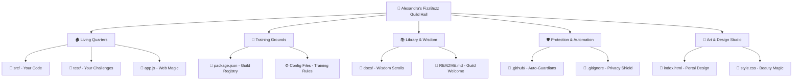
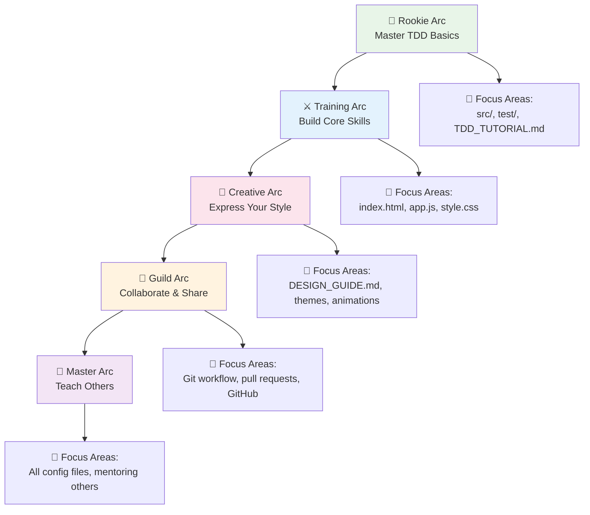
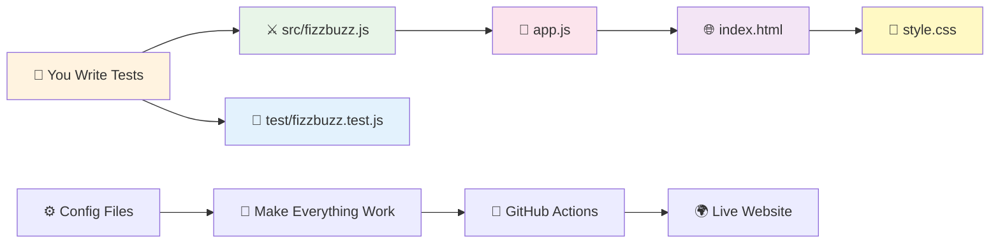

# Understanding Your Project Structure 📁

*Your Developer's Guild Hall Explained*

Hi Alexandra! Think of your project like a well-organized guild hall from your favorite isekai manga - every room has a purpose, every tool has its place, and everything works together to help you on your adventure! Let's explore your coding sanctuary and understand why each piece is essential for your journey! ⚔️🏰✨

## 🏗️ Your Guild Hall Blueprint

**Think of it like:** The architectural plans of the Fairy Tail guild hall - every room serves the guild's mission!



```
alexandra-fizzbuzz-js/
├── 📂 .github/                  # GitHub automation
│   ├── 📂 workflows/
│   │   ├── deploy.yml           # Auto-deploy your website
│   │   └── tests.yml            # Auto-run tests on every push
│   └── pull_request_template.md # Template for code reviews
├── 📂 docs/                     # Your learning guides
│   ├── TDD_TUTORIAL.md          # Step-by-step TDD guide
│   ├── VSCODE_SETUP.md          # VS Code configuration
│   ├── PROJECT_STRUCTURE.md     # This file!
│   ├── TOOLS_GLOSSARY.md        # What all the tools do
│   ├── GIT_WORKFLOW.md          # Git best practices
│   └── DESIGN_GUIDE.md          # Creative customization ideas
├── 📂 exercises/                # Extra challenges
│   └── CHALLENGES.md            # Advanced exercises when you're ready
├── 📂 src/                      # Your source code
│   └── fizzbuzz.js              # Your main FizzBuzz function
├── 📂 test/                     # Your test files
│   └── fizzbuzz.test.js         # Tests for your FizzBuzz function
├── 📄 index.html                # Your beautiful web interface
├── 📄 style.css                 # Styling for your web page
├── 📄 app.js                    # JavaScript that connects web to logic
├── 📄 package.json              # Project info and dependencies
├── 📄 package-lock.json         # Exact versions of dependencies
├── 📄 .gitignore                # Files Git should ignore
├── 📄 README.md                 # Your project homepage
├── 📄 CONTRIBUTING.md           # How others can contribute
├── 📄 CLAUDE.md                 # Instructions for AI assistants
└── ⚙️ Configuration files       # Tools that make development easier
    ├── jest.config.js           # Testing configuration
    ├── babel.config.js          # JavaScript transpilation
    ├── .eslintrc.js             # Code quality rules
    └── .prettierrc              # Code formatting rules
```

## 🎯 Core Files (What You'll Work With)

### Your Code Files

**📄 src/fizzbuzz.js**
- **What:** Your main FizzBuzz function
- **Why:** Separating source code from tests is a professional practice
- **You'll:** Write your fizzbuzz logic here using TDD

**📄 test/fizzbuzz.test.js**
- **What:** Tests that verify your code works
- **Why:** Tests catch bugs and guide development
- **You'll:** Add more tests as you build features

**📄 index.html**
- **What:** Your web page structure
- **Why:** Makes your project visually accessible
- **You'll:** See your FizzBuzz results in a beautiful interface

**📄 style.css**
- **What:** Makes your web page beautiful
- **Why:** Visual design is part of development
- **You'll:** Customize colors, animations, and themes

**📄 app.js**
- **What:** Connects your FizzBuzz logic to the web interface
- **Why:** Separates business logic from UI code
- **You'll:** Hook up your function to make the web page work

## ⚙️ Configuration Files (The Professional Setup)

### Testing Configuration

**📄 jest.config.js**
```javascript
// This tells Jest (our testing tool) how to work
module.exports = {
  testEnvironment: 'node',        // Run tests in Node.js
  collectCoverageFrom: ['src/**/*.js'], // Track which code is tested
  coverageThreshold: {            // Require 80% of code to be tested
    global: { branches: 80, functions: 80, lines: 80 }
  }
};
```
- **What:** Configuration for Jest testing framework
- **Why:** Ensures tests run correctly and maintains quality standards
- **Benefit:** You get detailed test reports and coverage metrics
- **Learn more:** See `docs/TOOLS_GLOSSARY.md` for detailed Jest explanation

**📄 babel.config.js**
```javascript
// This lets us use modern JavaScript features
module.exports = {
  presets: [['@babel/preset-env', {targets: {node: 'current'}}]],
};
```
- **What:** Transpiles modern JavaScript for compatibility
- **Why:** Lets you use latest JavaScript features
- **Benefit:** Your code works everywhere

### Code Quality Tools

**📄 .eslintrc.js**
```javascript
// This catches potential bugs and enforces coding standards
module.exports = {
  env: { browser: true, es2021: true, node: true, jest: true },
  extends: ['eslint:recommended', 'prettier'],
  rules: {
    'no-console': 'warn',        // Warn about console.log
    'no-unused-vars': 'error',   // Error on unused variables
    'prefer-const': 'error'      // Prefer const over let
  }
};
```
- **What:** Rules for writing clean, consistent code
- **Why:** Catches bugs before they happen
- **Benefit:** Your code follows professional standards

**📄 .prettierrc**
```json
{
  "semi": true,           // Always use semicolons
  "singleQuote": true,    // Use single quotes
  "printWidth": 80,       // Wrap lines at 80 characters
  "tabWidth": 2           // Use 2 spaces for indentation
}
```
- **What:** Automatic code formatting rules
- **Why:** Consistent, beautiful code without thinking about it
- **Benefit:** Your code always looks professional

### Project Information

**📄 package.json**
```json
{
  "name": "fizzbuzz-kata",
  "scripts": {
    "test": "jest",              // npm test runs Jest
    "lint": "eslint .",          // npm run lint checks code quality
    "format": "prettier --write ." // npm run format beautifies code
  },
  "devDependencies": {
    "jest": "^29.7.0",           // Testing framework
    "eslint": "^9.0.0",          // Code quality checker
    "prettier": "^3.2.0"         // Code formatter
  }
}
```
- **What:** Project metadata and dependencies
- **Why:** Defines what tools your project needs
- **Benefit:** Anyone can install and run your project

**📄 package-lock.json**
- **What:** Exact versions of all dependencies
- **Why:** Ensures everyone gets the same versions
- **Benefit:** No "works on my machine" problems
- **Note:** You never edit this manually - npm manages it

**📄 .gitignore**
```
node_modules/    # Don't track installed packages
coverage/        # Don't track test coverage reports
.env            # Don't track secret keys
```
- **What:** Tells Git which files to ignore
- **Why:** Keeps repository clean and secure
- **Benefit:** Only tracks files that matter

## 🤖 GitHub Automation

### **📂 .github/workflows/**

**📄 tests.yml**
- **What:** Runs your tests automatically on every push
- **Why:** Catches bugs before they reach the main branch
- **Magic:** Green checkmarks when tests pass, red X when they fail

**📄 deploy.yml**
- **What:** Automatically publishes your website
- **Why:** Your latest changes go live immediately
- **Magic:** Push code → Website updates automatically

**📄 pull_request_template.md**
- **What:** Template for code review requests
- **Why:** Standardizes how you ask for feedback
- **Professional:** Real companies use these templates

## 📚 Documentation Files

**📄 README.md**
- **What:** Your project's homepage on GitHub
- **Why:** First thing people see when visiting your project
- **You'll:** This is how you showcase your work

**📄 CONTRIBUTING.md**
- **What:** Guidelines for contributing to your project
- **Why:** Helps others understand how to help
- **Professional:** Open source projects always have this

**📄 CLAUDE.md**
- **What:** Instructions for AI coding assistants
- **Why:** Helps AI understand your project context
- **Future:** When you work with AI, it reads this file

## 🎓 Learning Files

**📂 docs/**
- **What:** Your personal learning library
- **Why:** Professional projects always have good documentation
- **Contains:** Tutorials, guides, and references

**📂 exercises/**
- **What:** Additional challenges when you're ready
- **Why:** Keeps you learning and growing
- **Future:** Come back here when you want to level up

## 🤔 Why So Many Files?

**For a beginner, this might seem like a lot, but here's why each file matters:**

### 🛡️ **Quality Assurance**
- Tests prevent bugs
- Linters catch mistakes
- Formatters keep code clean

### 🚀 **Automation**
- CI/CD handles repetitive tasks
- You focus on coding, not deployment

### 👥 **Collaboration**
- Clear structure helps others understand your project
- Documentation makes your project accessible

### 🎯 **Professional Standards**
- This is how real companies structure projects
- You're learning industry best practices

## 💡 Alexandra's Development Journey

**Phase 1 (Now):** Focus on `src/` and `test/` - build your FizzBuzz function

**Phase 2 (Soon):** Connect to `index.html` and `app.js` - make it visual

**Phase 3 (Later):** Customize `style.css` - make it beautiful and unique

**Phase 4 (Advanced):** Explore `exercises/` - challenge yourself

**Phase 5 (Pro):** Understand all config files - become a setup expert

## 🎉 You're Learning Real Development!

Every file in this project serves a purpose in professional development:
- **Configuration files** automate boring tasks
- **Documentation** helps others (and future you) understand the project
- **Automation** prevents human errors
- **Structure** keeps complex projects organized

Don't worry about understanding everything immediately. Focus on your FizzBuzz function, and as you grow as a developer, you'll appreciate why each piece is there!

## 🔍 Quick Reference

**Need to find something?**
- **Your code:** `src/fizzbuzz.js`
- **Your tests:** `test/fizzbuzz.test.js`
- **Web interface:** `index.html`, `style.css`, `app.js`
- **Learning guides:** `docs/` folder
- **Commands:** `package.json` scripts section
- **Tool explanations:** `docs/TOOLS_GLOSSARY.md`

**Don't touch (yet):**
- `package-lock.json` (auto-generated)
- `.github/` (automation)
- Config files (they're working perfectly!)

## 🚀 Your Development Adventure Path

**Think of it like:** Advancing through different arcs in your favorite manga series!



### How Your Guild Hall Comes to Life

```mermaid
sequenceDiagram
    participant You as 🧙‍♀️ Alexandra
    participant Test as 🧪 Jest Sensei
    participant Code as ⚔️ fizzbuzz.js
    participant Web as 🌐 Web Portal
    participant GitHub as 🏰 Guild Hall
    
    You->>Test: "I want to test fizzbuzz(1)"
    Test->>Code: "Do you know what fizzbuzz is?"
    Code->>Test: "❌ No, I don't exist yet!"
    You->>Code: "function fizzbuzz() { return '1'; }"
    Code->>Test: "✅ Yes! I return '1'!"
    You->>Web: "Connect my function to the interface"
    Web->>Code: "Give me fizzbuzz results for 1-15"
    Code->>Web: "['1', '2', 'Fizz', '4', 'Buzz'...]"
    You->>GitHub: "Save my masterpiece!"
    GitHub->>Web: "🚀 Deploy to the world!"
```

### Your File Relationship Map



## 🎊 You're Ready to Begin Your Adventure!

Your guild hall is perfectly prepared, Alexandra! Every tool is in its place, every scroll contains wisdom, and every magical artifact is ready to aid you on your coding quest.

**Remember the developer's creed:**
- *Every expert was once a beginner*
- *Every bug is a teacher in disguise* 
- *Every commit is a step forward*
- *Every green test is a small victory*

Ready to start coding? Head back to `docs/TDD_TUTORIAL.md` and let's build something amazing! 🚀✨