# Alexandra's TDD Adventure: Your Hero's Training Arc! 🥋📚

*Learning Test-Driven Development Through Your Coding Journey*

Welcome to your developer training arc, Alexandra! Just like every great manga protagonist, you're about to embark on a journey that will transform you from a beginner into a confident coder. TDD is your training method - the secret technique that professional developers use to write bulletproof code! ⚔️✨

## 🎯 What is TDD? (The Ancient Developer Art)

Test-Driven Development is like the martial arts training sequences you see in manga - disciplined, structured, and incredibly powerful once mastered!

```mermaid
flowchart TD
    A[🔴 RED: Write Failing Test] --> B[🟢 GREEN: Make It Pass]
    B --> C[🔵 REFACTOR: Make It Beautiful]
    C --> D[🎉 Commit Your Victory!]
    D --> E{🤔 Need More Features?}
    E -->|Yes| A
    E -->|No| F[🚀 Deploy Your Masterpiece!]
    
    style A fill:#ffebee
    style B fill:#e8f5e8
    style C fill:#e3f2fd
    style D fill:#fff3e0
    style F fill:#f3e5f5
```

### The Sacred TDD Cycle (Your Training Kata) 🥋

**Think of it like:** The repetitive training exercises that make anime heroes incredibly strong

1. **🔴 RED Phase - The Challenge Appears**
   - Write a test that fails
   - Like facing a new opponent you can't beat yet
   - The failure shows you exactly what to learn

2. **🟢 GREEN Phase - Find Your Power**
   - Write the simplest code to pass the test
   - Like discovering the technique to defeat the opponent
   - No need to be perfect - just make it work!

3. **🔵 REFACTOR Phase - Perfect Your Technique**
   - Clean up and improve your code
   - Like polishing your fighting stance after you've won
   - Make it beautiful and efficient

### Why TDD is Your Secret Weapon 💪


**Like any good training arc:**
- **You never get lost** - Tests tell you exactly what to build next
- **You catch problems early** - Before they become major villains
- **You build confidence** - Every green test is a small victory
- **You write better code** - Clean, organized, professional

---

## 🚀 Your FizzBuzz Training Arc Begins!

### Understanding Your Starting Point 📍

```mermaid
graph TD
    A[📁 Your Project] --> B[📂 src/fizzbuzz.js<br/>Empty - Waiting for your magic!]
    A --> C[📂 test/fizzbuzz.test.js<br/>One test - Your first challenge!]
    A --> D[📄 package.json<br/>Your adventure inventory]
    
    style B fill:#fff3e0
    style C fill:#e3f2fd
    style D fill:#f3e5f5
```

Right now you have:
- **Empty fizzbuzz.js** - Like a blank scroll waiting for your technique
- **One test** - Your first training challenge
- **All tools ready** - Jest (your sensei), ESLint (your mentor), Prettier (your style master)

---

## 🥋 Chapter 1: Face Your First Challenge

### Step 1: See the Challenge (RED 🔴)

**What you're doing:** Running your first test to see it fail

**Think of it like:** Meeting your first training opponent - you're supposed to lose at first!

**Your mission:**
1. Open your terminal in VS Code (`Terminal` → `New Terminal`)
2. Type the magic command:
   ```bash
   npm test
   ```
3. Watch what happens!

```mermaid
sequenceDiagram
    participant You as 🧙‍♀️ Alexandra
    participant Terminal as 💻 Terminal
    participant Jest as 🧪 Jest Sensei
    participant Test as 📝 Your Test
    
    You->>Terminal: npm test
    Terminal->>Jest: Wake up, sensei!
    Jest->>Test: What challenge do we have?
    Test->>Jest: Check if fizzbuzz(1) returns "1"
    Jest->>Jest: Looking for fizzbuzz function...
    Jest->>You: ❌ ERROR: fizzbuzz is not defined!
```

**What you'll see (don't panic!):**
```
ReferenceError: fizzbuzz is not defined
```

**Translation:** "I don't know what 'fizzbuzz' is - you haven't created it yet!"

**This is PERFECT!** 🎉 Like in manga when the hero first faces an impossible challenge - this failure tells you exactly what you need to learn!

### Step 2: Your First Victory (GREEN 🟢)

**What you're doing:** Creating the fizzbuzz function to make the test pass

**Think of it like:** Learning your first technique to defeat the opponent

**Your mission:**
1. Open `src/fizzbuzz.js`
2. Look at what the test expects:
   ```javascript
   expect(fizzbuzz(1)).toBe('1');
   ```
3. Create the simplest solution that works

**What the test is asking:**
- "When I give fizzbuzz the number 1, I want it to give me back the string '1'"

**Your first technique (write this in fizzbuzz.js):**
```javascript
function fizzbuzz(number) {
  return '1';  // Simple but effective - like a basic punch!
}

module.exports = fizzbuzz;
```

**Now test your technique:**
```bash
npm test
```


**Victory moment!** 🎊 You should see:
```
✅ returns "1" when given 1
```

Like Goku throwing his first successful Kamehameha - it's basic, but it WORKS!

### Step 3: Save Your Progress (Commit) 💎

**What you're doing:** Creating a save point in your adventure

**Think of it like:** Saving your game after beating a boss

```bash
git add .
git commit -m "feat: fizzbuzz returns '1' for input 1"
```

```mermaid
graph LR
    A[💾 Your Victory] --> B[📜 Git Time Scroll]
    B --> C[💎 Saved Forever!]
    C --> D[🛡️ Protected Against Future Mistakes]
```

---

## 🥋 Chapter 2: Level Up Your Technique

### The Next Challenge Appears 🔴

**Your growth mindset:** "What's the next simplest thing my function should handle?"

**Think about the FizzBuzz rules:**
- Regular numbers → return as string
- Numbers divisible by 3 → return "Fizz"
- Numbers divisible by 5 → return "Buzz"
- Numbers divisible by both → return "FizzBuzz"

**Your next opponent:** Make it work for number 2

**Add this test to `test/fizzbuzz.test.js`:**
```javascript
test('returns "2" when given 2', () => {
  expect(fizzbuzz(2)).toBe('2');
});
```

**Run the test:**
```bash
npm test
```

**What happens:** The new test fails! Your function only knows how to return '1'

```mermaid
graph TD
    A[🧪 Jest Tests Both] --> B[✅ Test 1: Passes]
    A --> C[❌ Test 2: Fails]
    C --> D[Expected: '2'<br/>Received: '1']
    
    style B fill:#c8e6c9
    style C fill:#ffcdd2
```

### Evolve Your Technique 🟢

**Think like a strategist:** How can you handle both 1 AND 2?

**The revelation:** Return the number as a string!

**Update your fizzbuzz.js:**
```javascript
function fizzbuzz(number) {
  return number.toString();  // Works for any number!
}

module.exports = fizzbuzz;
```

**Test your evolved technique:**
```bash
npm test
```

**Both tests should pass!** ✅✅

```mermaid
flowchart TD
    A[🧪 Jest Tests Everything] --> B["✅ fizzbuzz(1) returns '1'"]
    A --> C["✅ fizzbuzz(2) returns '2'"]
    B --> D[🎉 All Tests Passing!]
    C --> D
    
    style D fill:#c8e6c9
```

**Save your new power:**
```bash
git add .
git commit -m "feat: fizzbuzz returns string for any number"
```

---

## 🥋 Chapter 3: Face the Fizz Challenge

### The Plot Thickens 🔴

**Your next challenge:** Numbers divisible by 3 should return "Fizz"

**Add this test:**
```javascript
test('returns "Fizz" when given 3', () => {
  expect(fizzbuzz(3)).toBe('Fizz');
});
```

**Run the test - it will fail!**
```
Expected: "Fizz"
Received: "3"
```

Your current technique isn't enough for this new challenge!

### Develop New Abilities 🟢

**Strategy time:** You need to check if a number is divisible by 3

**The technique:**
```javascript
function fizzbuzz(number) {
  if (number === 3) {
    return 'Fizz';
  }
  return number.toString();
}
```

**Test it:** This passes for 3, but what about 6, 9, 12?

**Add another test for 6:**
```javascript
test('returns "Fizz" when given 6', () => {
  expect(fizzbuzz(6)).toBe('Fizz');
});
```

**This will fail!** Time to generalize your technique:

```javascript
function fizzbuzz(number) {
  if (number % 3 === 0) {  // The modulo operator - checks if divisible by 3
    return 'Fizz';
  }
  return number.toString();
}
```

```mermaid
flowchart TD
    A[📊 Number Comes In] --> B{🤔 Is number % 3 === 0?}
    B -->|Yes| C[🎯 Return 'Fizz']
    B -->|No| D[📝 Return number as string]
    
    style C fill:#fce4ec
    style D fill:#e8f5e8
```

**Save your Fizz mastery:**
```bash
git add .
git commit -m "feat: fizzbuzz returns 'Fizz' for multiples of 3"
```

---

## 🥋 Chapter 4: The Buzz Technique

### New Opponent Appears 🔴

**Challenge:** Numbers divisible by 5 should return "Buzz"

**Your test:**
```javascript
test('returns "Buzz" when given 5', () => {
  expect(fizzbuzz(5)).toBe('Buzz');
});
```

### Master the Buzz 🟢

**Your evolved technique:**
```javascript
function fizzbuzz(number) {
  if (number % 3 === 0) {
    return 'Fizz';
  }
  if (number % 5 === 0) {
    return 'Buzz';
  }
  return number.toString();
}
```

```mermaid
flowchart TD
    A[📊 Number Input] --> B{🤔 Divisible by 3?}
    B -->|Yes| C[🎯 Return 'Fizz']
    B -->|No| D{🤔 Divisible by 5?}
    D -->|Yes| E[💙 Return 'Buzz']
    D -->|No| F[📝 Return number as string]
    
    style C fill:#fce4ec
    style E fill:#e3f2fd
    style F fill:#e8f5e8
```

**Save your dual mastery:**
```bash
git add .
git commit -m "feat: fizzbuzz returns 'Buzz' for multiples of 5"
```

---

## 🥋 Chapter 5: The Ultimate Technique - FizzBuzz!

### The Final Boss Challenge 🔴

**The ultimate test:** What happens with 15? (Divisible by both 3 AND 5)

**Add the test:**
```javascript
test('returns "FizzBuzz" when given 15', () => {
  expect(fizzbuzz(15)).toBe('FizzBuzz');
});
```

**Run it - it fails!** Returns "Fizz" instead of "FizzBuzz"

**Why?** Your code checks 3 first, finds it's true, and returns "Fizz" without checking 5!

### Master the Ultimate Technique 🟢

**The secret:** Check for BOTH conditions first!

```javascript
function fizzbuzz(number) {
  if (number % 3 === 0 && number % 5 === 0) {  // Check both first!
    return 'FizzBuzz';
  }
  if (number % 3 === 0) {
    return 'Fizz';
  }
  if (number % 5 === 0) {
    return 'Buzz';
  }
  return number.toString();
}
```

```mermaid
flowchart TD
    A[📊 Number Input] --> B{🤔 Divisible by 3 AND 5?}
    B -->|Yes| C[🌟 Return 'FizzBuzz']
    B -->|No| D{🤔 Divisible by 3?}
    D -->|Yes| E[🎯 Return 'Fizz']
    D -->|No| F{🤔 Divisible by 5?}
    F -->|Yes| G[💙 Return 'Buzz']
    F -->|No| H[📝 Return number as string]
    
    style C fill:#fff3e0
    style E fill:#fce4ec
    style G fill:#e3f2fd
    style H fill:#e8f5e8
```

**Test your ultimate technique:**
```bash
npm test
```

**All tests should pass!** You've mastered the basic FizzBuzz technique! 🎊

**Save your mastery:**
```bash
git add .
git commit -m "feat: fizzbuzz handles FizzBuzz for multiples of both 3 and 5"
```

---

## 🚀 Advanced Training: The Range Technique

### Power-Up Challenge 🔴

**Your growth:** Create a function that handles multiple numbers at once

**Add this test:**
```javascript
describe('FizzBuzz Range', () => {
  test('returns array for range 1 to 5', () => {
    expect(fizzbuzzRange(1, 5)).toEqual(['1', '2', 'Fizz', '4', 'Buzz']);
  });
});
```

### Develop Your Range Power 🟢

**Add to your fizzbuzz.js:**
```javascript
function fizzbuzzRange(start, end) {
  const results = [];
  for (let i = start; i <= end; i++) {
    results.push(fizzbuzz(i));
  }
  return results;
}

// Export both functions
module.exports = { fizzbuzz, fizzbuzzRange };
```

**Update your test import:**
```javascript
const { fizzbuzz, fizzbuzzRange } = require('../src/fizzbuzz');
```

```mermaid
graph LR
    A[🔢 Start: 1] --> B[🔄 Loop Through Numbers]
    B --> C[📞 Call fizzbuzz for each]
    C --> D[📦 Collect Results]
    D --> E[🔢 End: 5]
    E --> F[📋 Return Array]
    
    style F fill:#c8e6c9
```

**Test your range mastery:**
```bash
npm test
```

**Save your advanced technique:**
```bash
git add .
git commit -m "feat: add fizzbuzzRange function for multiple numbers"
```

---

## 🌐 Final Chapter: Connect to Your Web Portal

Now that you've mastered the FizzBuzz technique, it's time to share it with the world!

**Your web interface awaits in `app.js`** - update it to use your powerful new functions!

---

## 🎊 Congratulations, Developer Hero!

```mermaid
graph TD
    A[🌱 Beginner Alexandra] --> B[🧪 Learned TDD Cycle]
    B --> C[⚔️ Mastered Testing]
    C --> D[🎯 Built FizzBuzz]
    D --> E[🌟 Confident Developer!]
    
    style A fill:#ffecb3
    style E fill:#c8e6c9
```

### Your New Superpowers ⚡

**You've unlocked:**
- ✅ **TDD Mastery** - You know the Red-Green-Refactor cycle
- ✅ **Test Writing** - You can describe what your code should do
- ✅ **Debugging Skills** - You can read error messages like a pro
- ✅ **Git Workflow** - You save progress like a professional
- ✅ **Confidence Building** - Every green test proves you're growing!

### What You've Learned (The Deep Magic) 🧙‍♀️

**TDD teaches you to:**
1. **Think before coding** - Tests force you to plan
2. **Take small steps** - One test at a time prevents overwhelm
3. **Catch bugs early** - Problems are caught immediately
4. **Write better code** - Tests guide you to good design
5. **Refactor fearlessly** - Tests protect you when changing code

### Your Developer Journey Continues 🚀

**Next adventures:**
1. **Connect your web interface** - Make your FizzBuzz visual!
2. **Add more features** - Error handling, validation, themes
3. **Master Git branches** - Learn professional collaboration
4. **Share your work** - Create pull requests and get feedback
5. **Help others** - Teach someone else TDD!

---

## 🆘 Troubleshooting: When Your Code Rebels

### Common Boss Battles & How to Win 💪

```mermaid
flowchart TD
    A[😱 Error Appears!] --> B[📖 Read Error Message<br/>Carefully]
    B --> C{"🤔 What Type<br/>of Error?"}
    C -->|Syntax Error| D[🔍 Check Brackets,<br/>Commas, Quotes]
    C -->|Reference Error| E[🔍 Check Function/<br/>Variable Names]
    C -->|Test Failure| F[🔍 Compare Expected<br/>vs Actual]
    D --> G[🔧 Fix and<br/>Test Again]
    E --> G
    F --> G
    G --> H[🎉 Victory!]
```

**Error Translation Guide:**
- `fizzbuzz is not defined` → "Create the fizzbuzz function"
- `Unexpected token` → "Check your syntax - missing bracket or comma"
- `Expected "Fizz" but received "3"` → "Your logic needs adjustment"

### When Tests Fail 🧪❌

**Your debugging jutsu:**
1. **Read the story** - Error messages tell you exactly what's wrong
2. **One at a time** - Fix one test before moving to the next
3. **Use console.log** - Add `console.log(number)` to see what you're getting
4. **Check the math** - Is 15 % 3 really equal to 0? Test it!

**Example debugging:**
```javascript
function fizzbuzz(number) {
  console.log('Input:', number);  // See what's coming in
  console.log('Divisible by 3?', number % 3 === 0);  // Check your logic
  // ... rest of your code
}
```

---

## 🌟 Inspirational Developer Wisdom

> *"In the world of coding, there are no shortcuts to any place worth going."*  
> — Like Tanjiro's dedication in Demon Slayer, consistent practice beats natural talent

> *"A test that fails is not a failure - it's a teacher showing you the way."*  
> — Like how Senku uses every failed experiment as data in Dr. Stone

> *"Every expert developer was once a complete beginner who decided not to give up."*  
> — Like All Might telling Deku he can become a hero

---

## 📚 Your TDD Spell Book (Quick Reference)

**The Sacred TDD Cycle:**
```
🔴 RED    → Write failing test
🟢 GREEN  → Make it pass (simplest way)
🔵 REFACTOR → Make it beautiful
💎 COMMIT → Save your progress
```

**Essential Commands:**
```bash
npm test                    # Summon Jest sensei
npm run test:watch          # Continuous training mode
git add . && git commit -m  # Save progress crystal
```

**Test Writing Pattern:**
```javascript
test('describes what should happen', () => {
  expect(yourFunction(input)).toBe(expectedOutput);
});
```

---

## 🎯 Alexandra's Next Quest

Ready for more adventures? Check out:
- **`exercises/CHALLENGES.md`** - Advanced FizzBuzz challenges
- **`docs/GIT_WORKFLOW.md`** - Master Git like a pro
- **`docs/DESIGN_GUIDE.md`** - Make your interface beautiful

Remember: Every anime hero started with basic training. You've just completed your foundation training arc - now the real adventures begin! 

**Your coding journey is just getting started!** 🌟⚔️✨

---

*Now go forth and test-drive your way to coding mastery, Alexandra! The development world awaits your unique creativity!* 🚀📚💜