# Development Tools Glossary 🛠️ 

*A Beginner's Guide to the Developer's Arsenal*

Hi Alexandra! Think of this project like a manga where you're the protagonist learning to become a powerful developer! Each tool is like a special ability or weapon that helps you on your coding journey. Let's explore your developer toolkit! ⚔️✨

## 🎯 The Big Picture: Your Developer Journey

```mermaid
graph TD
    A[🌟 You: Alexandra the<br/>Aspiring Developer] --> B[📚 Learn TDD]
    B --> C[⚔️ Master Your<br/>Tools]
    C --> D[🏗️ Build Amazing<br/>Projects]
    D --> E[🌍 Share With<br/>the World]
    
    C --> F[🧪 Jest:<br/>Your Testing Sensei]
    C --> G[📏 ESLint:<br/>Your Code Mentor]
    C --> H[💅 Prettier:<br/>Your Style Master]
    C --> I[📜 Git:<br/>Your Time Scroll]
    C --> J[🏰 GitHub:<br/>Your Guild Hall]
```

---

## 🧪 Testing Tools: Your Training Partners

### **Jest** - Your Testing Sensei 🥋

**Think of it like:** A martial arts master who constantly tests your skills to make you stronger

**What it actually is:** A JavaScript testing framework (a program that runs your tests)

**The manga analogy:** 
- In shonen manga, heroes train with strict masters who push them to their limits
- Jest is like Jiraiya from Naruto or Master Roshi from Dragon Ball
- It gives you challenges (tests) and tells you "Pass!" ✅ or "Try again!" ❌
- Every time you pass a test, you've leveled up your coding skills!

```mermaid
flowchart LR
    A[🧪 Jest<br/>Sensei] --> B[📝 Reads Your<br/>Tests]
    B --> C{"🤔 Does Your<br/>Code Pass?"}
    C -->|Yes ✅| D[🎉 Congratulations!<br/>Level Up!]
    C -->|No ❌| E[💪 Train Harder!<br/>Here's What's Wrong...]
    E --> F[🔧 Fix Your<br/>Code]
    F --> B
```

**What Jest does in simple terms:**
1. **Finds all your test files** (like `.test.js`) - it's like a sensei gathering all training scrolls
2. **Runs each test** - puts your code through challenges
3. **Shows results** - green for victory, red for "needs more training"
4. **Gives detailed feedback** - explains exactly what went wrong, like a good teacher

**Cool Jest features:**
- **Watch mode** (`npm run test:watch`) - Like having a training partner who never sleeps! Tests run automatically when you save
- **Coverage reports** - Shows which parts of your code have been tested (like a completion percentage in RPG games)
- **Detailed error messages** - Instead of just saying "failed," it tells you exactly what was expected vs what happened

---

## 📏 Code Quality Tools: Your Mentors and Guides

### **ESLint** - Your Strict Code Mentor 👨‍🏫

**Think of it like:** That one sensei who corrects your stance before you even realize it's wrong

**What it actually is:** A "linter" (a program that analyzes your code for problems)

**The manga analogy:**
- Like Piccolo training Gohan - strict but caring
- Catches mistakes before they become big problems
- Has rules for "proper form" in coding
- Sometimes annoying but makes you a better developer

```mermaid
graph TD
    A[📝 You Write<br/>Code] --> B[👁️ ESLint<br/>Watches]
    B --> C{"🔍 Any<br/>Problems?"}
    C -->|Found Issues ⚠️| D[🚨 Red Squiggly<br/>Lines Appear]
    C -->|All Good ✅| E[😊 Clean Code,<br/>Well Done!]
    D --> F[🔧 Fix the<br/>Issues]
    F --> A
```

**What ESLint catches (with examples):**

```javascript
// ❌ ESLint catches these mistakes:
let x = 5;  // Variable declared but never used
if (x = 5)  // Assignment instead of comparison (should be ===)
console.log("debugging stuff");  // Warns about leftover console.log

// ✅ ESLint approves of this:
const result = fizzbuzz(3);
if (result === 'Fizz') {
  return result;
}
```

**Why this is like manga training:**
- Heroes need proper form to be effective
- Small mistakes in stance can lead to big failures in battle
- Better to catch problems during training than during the real fight!

### **Prettier** - Your Style Master 💅

**Think of it like:** A magical transformation sequence that makes everything beautiful instantly

**What it actually is:** An auto-formatter that makes your code look professional

**The manga analogy:**
- Like Sailor Moon's transformation - messy becomes beautiful in seconds!
- Or like how anime characters always look perfect after their "power-up" scenes
- Takes your rough code and makes it magazine-worthy

**Before and After Magic:**

```javascript
// Before Prettier (messy, like bed hair):
function fizzbuzz(number){if(number%3===0&&number%5===0){return"FizzBuzz"}else if(number%3===0){return"Fizz"}
return number.toString()}

// After Prettier (beautiful, like anime character hair):
function fizzbuzz(number) {
  if (number % 3 === 0 && number % 5 === 0) {
    return 'FizzBuzz';
  } else if (number % 3 === 0) {
    return 'Fizz';
  }
  return number.toString();
}
```

```mermaid
sequenceDiagram
    participant You
    participant Prettier
    participant Code
    
    You->>Code: Types messy code
    You->>Prettier: Saves file (Ctrl+S)
    Prettier->>Code: ✨ TRANSFORMATION<br/>SEQUENCE ✨
    Code->>You: Beautiful, professional<br/>code appears!
```

---

## 🏗️ Build Tools: Your Equipment Forgers

### **Babel** - Your Mystical Translator 📜

**Think of it like:** A universal translation magic that lets ancient spells work in the modern world

**What it actually is:** A "transpiler" that converts modern JavaScript to work everywhere

**The manga analogy:**
- Like the babel fish from Hitchhiker's Guide, but for code!
- You write spells (code) in the latest magical language
- Babel translates them so they work on older magic systems (browsers)
- Let's you use the coolest new techniques without worrying about compatibility

```mermaid
graph LR
    A[✨ Modern JavaScript<br/>Arrow Functions, Const, etc.] --> B[🔮 Babel<br/>Translator]
    B --> C[🏛️ Old JavaScript<br/>Works Everywhere]
    
    subgraph "Your Modern Code"
    D["const greet = (name) =><br/>`Hello ${name}!`"]
    end
    
    subgraph "Babel's Translation"
    E["function greet(name) {<br/>  return 'Hello ' + name + '!';<br/>}"]
    end
    
    D --> B
    B --> E
```

### **npm** - Your Item Shop & Guild System 🏪

**Think of it like:** The shop where you buy weapons, potions, and equipment + the guild system for sharing quests

**What it actually is:** Node Package Manager - downloads and manages code libraries

**The manga analogy:**
- Like the item shop in any RPG manga where heroes buy gear
- Need a fire spell? There's a package for that
- Need healing potions? There's a package for that too
- Other developers are like guild members sharing their discoveries

```mermaid
graph TD
    A["🧙‍♀️ You Need<br/>a Power"] --> B["🏪 npm<br/>Item Shop"]
    B --> C["🔍 Search for<br/>Packages"]
    C --> D["📦 Find the<br/>Perfect Tool"]
    D --> E["⬇️ Download &<br/>Install"]
    E --> F["🎒 Add to Your Inventory<br/>(package.json)"]
    F --> G["⚔️ Use in<br/>Your Quest!"]
```

**npm commands (your shop interactions):**
```bash
npm install     # "I'll take everything on my shopping list!"
npm test        # "Activate my testing abilities!"
npm run serve   # "Set up my mystical web portal!"
```

---

## 🌐 Web Development: Your Magic Portal Creation

### **HTTP Server** - Your Portal Generator 🌀

**Think of it like:** Creating a magical portal so others can visit your world

**What it actually is:** A program that serves your website files

**The manga analogy:**
- Like creating a dimensional gate in isekai manga
- Your code lives in your computer dimension
- The server creates a bridge so browsers can visit
- `localhost:8080` is like the coordinates to your pocket dimension!

```mermaid
sequenceDiagram
    participant You as 🧙‍♀️ Alexandra
    participant Server as 🌀 HTTP Server
    participant Browser as 🌐 Browser Portal
    
    You->>Server: npm run serve
    Server->>Server: ✨ Opens dimensional<br/>gate
    Server->>You: Portal ready at<br/>localhost:8080!
    You->>Browser: Opens portal<br/>coordinates
    Browser->>Server: Requesting entry<br/>to dimension
    Server->>Browser: Welcome! Here's<br/>the website
```

---

## 📜 Version Control: Your Time Magic

### **Git** - Your Time Scroll of Infinite Saves 🕰️

**Think of it like:** A magical scroll that saves every moment of your adventure

**What it actually is:** A version control system that tracks changes to your code

**The manga analogy:**
- Like save points in video games, but for real life!
- Every `git commit` is like creating a save crystal
- You can go back to any previous save if something goes wrong
- Multiple timelines (branches) like in time-travel manga
- Never lose your progress again!

```mermaid
flowchart TD
    A["🌱 Initial Setup"] --> B["✅ First Test Passes"]
    B --> C["🔥 Add Fizz Logic"]
    C --> D["💫 Add Buzz Logic"]
    D --> E["🧪 More Tests"]
    
    D --> F["🎨 Create Beautiful UI<br/>(feature branch)"]
    F --> G["✨ Add Animations<br/>(feature branch)"]
    
    E --> H["🤝 Merge Feature Branch"]
    G --> H
    H --> I["🚀 Ready for Release!"]
    
    style F fill:#e3f2fd
    style G fill:#e3f2fd
    style H fill:#fff3e0
    style I fill:#c8e6c9
```

**Git workflow (your time magic ritual):**
```bash
git add .           # "Gather all my progress"
git commit -m "..."  # "Seal it in a time crystal"
git push            # "Send to the dimensional archive"
```

### **GitHub** - Your Adventurer's Guild Hall 🏰

**Think of it like:** The guild hall where all adventurers gather, share quests, and collaborate

**What it actually is:** A cloud platform for storing and sharing Git repositories

**The manga analogy:**
- Like the Fairy Tail guild hall or the Adventurer's Guild in isekai manga
- Your code quests are stored safely in the cloud
- Other developers can see your adventures
- You can collaborate on epic quests together
- Your portfolio shows all your completed adventures!

```mermaid
graph TD
    A[🏠 Your Local<br/>Computer] -->|git push| B[🏰 GitHub<br/>Guild Hall]
    B --> C[📖 Public Quest Board<br/>Your Repositories]
    B --> D[👥 Other Adventurers<br/>Can See Your Work]
    B --> E[🤝 Collaboration Zone<br/>Pull Requests]
    B --> F[🚀 Auto-Deploy Magic<br/>GitHub Actions]
    
    F --> G[🌍 Live Website<br/>Your Creation Online!]
```

---

## 🤖 Automation: Your Magical Familiars

### **GitHub Actions** - Your Automated Training Dummies 🎯

**Think of it like:** Magical familiars that automatically test your abilities whenever you practice

**What it actually is:** Automated workflows that run tasks when you push code

**The manga analogy:**
- Like those training dummies in martial arts manga that activate automatically
- Every time you push code, they spring to life and test everything
- If you pass all tests, they give you a green badge of approval
- If something's wrong, they immediately alert you

```mermaid
sequenceDiagram
    participant You as 🧙‍♀️ You
    participant GitHub as 🏰 GitHub
    participant Actions as 🤖 GitHub Actions
    participant Tests as 🎯 Training Dummies
    participant Deploy as 🚀 Deploy Familiar
    
    You->>GitHub: git push<br/>(new code)
    GitHub->>Actions: Wake up,<br/>familiars!
    Actions->>Tests: Test the new<br/>abilities!
    Tests->>Tests: Running all<br/>tests...
    Tests->>Actions: ✅ All tests<br/>passed!
    Actions->>Deploy: Deploy to live<br/>website!
    Deploy->>You: 🌍 Your site is<br/>updated!
```

---

## 🎨 Design & CSS: Your Artistic Magic

### **CSS Variables** - Your Color-Changing Spell Components 🎨

**Think of it like:** Magical ink that changes color throughout your entire spellbook when you change the formula

**What it actually is:** Reusable values in CSS that you can change in one place

```css
/* Your magical color formulas */
:root {
  --primary-color: #667eea;    /* Main spell color */
  --fizz-color: #f093fb;       /* Fizz spell pink */
  --buzz-color: #4facfe;       /* Buzz spell blue */
}

/* Using the spells throughout your design */
.fizz {
  background: var(--fizz-color); /* Pulls from your formula */
}
```

**Why this is magical:**
- Change the formula once, see it update everywhere!
- Like having a master palette that controls your entire art style
- Perfect for creating themes (dark mode, light mode, rainbow mode!)

---

## 🧠 Understanding the Development Flow

```mermaid
flowchart TD
    A["💭 You Have<br/>an Idea"] --> B["✍️ Write<br/>a Test"]
    B --> C["❌ Test Fails<br/>(Red)"]
    C --> D["⚔️ Write Code<br/>to Pass"]
    D --> E["✅ Test Passes<br/>(Green)"]
    E --> F["🎨 Make Code Beautiful<br/>(Refactor)"]
    F --> G["💎 Commit Your<br/>Progress"]
    G --> H{"🤔 More Features<br/>Needed?"}
    H -->|Yes| B
    H -->|No| I["🚀 Deploy to<br/>World!"]
    
    G --> J["🤖 GitHub Actions<br/>Awaken"]
    J --> K["🧪 Run All<br/>Tests"]
    K --> L["📝 Check Code<br/>Quality"]
    L --> M["🌍 Auto-Deploy<br/>if Perfect"]
```

---

## 🎮 Your Developer Level-Up System

### **Beginner Level (1-10): Learning the Basics**
- **Main Quest:** Master the TDD cycle
- **Tools to Focus On:** Jest, ESLint, Prettier
- **Special Abilities Unlocked:** Writing tests, making them pass
- **Achievement:** First green test! 🟢

### **Adventurer Level (11-25): Building Confidence**
- **Main Quest:** Create your first web interface
- **Tools to Add:** Git workflow, HTTP server
- **Special Abilities Unlocked:** Time travel (git), portal creation (local server)
- **Achievement:** First live website! 🌐

### **Guild Member Level (26-50): Collaboration**
- **Main Quest:** Share your work with the world
- **Tools to Master:** GitHub, GitHub Actions
- **Special Abilities Unlocked:** Collaboration, automated deployment
- **Achievement:** First pull request! 🤝

### **Master Developer Level (51+): Teaching Others**
- **Main Quest:** Help other developers level up
- **Tools to Explore:** Advanced testing, performance optimization
- **Special Abilities Unlocked:** Mentoring, code review mastery
- **Achievement:** Contributing to open source! 🌟

---

## 🚨 When Things Go Wrong: Debug Mode Activated!

### **Red Squiggly Lines Everywhere!** 🚨
```mermaid
flowchart LR
    A[😱 Code Looks<br/>Angry] --> B[📖 Read the<br/>Error Message]
    B --> C[🔍 Check ESLint<br/>Suggestions]
    C --> D[🔧 Fix One Thing<br/>at a Time]
    D --> E[💾 Save and See if<br/>Lines Disappear]
    E --> F{"Still<br/>Red?"}
    F -->|Yes| B
    F -->|No| G[🎉 Victory<br/>Dance!]
```

**Translation guide for error messages:**
- `fizzbuzz is not defined` = "I don't know what fizzbuzz is - did you forget to create the function?"
- `Unexpected token` = "Something's in the wrong place - check your brackets and commas"
- `Cannot read property of undefined` = "You're trying to use something that doesn't exist"

### **Tests Failing?** 🧪❌
1. **Read the error like a story** - it tells you exactly what went wrong
2. **Compare expected vs actual** - what did you expect vs what happened?
3. **One test at a time** - don't try to fix everything at once
4. **Use console.log** - like adding debug prints to see what's happening

---

## 🌟 Motivational Manga Wisdom for Developers

> *"The code you write today is the foundation for the amazing developer you'll become tomorrow!"* 
> — Like Deku in My Hero Academia, every small improvement makes you stronger

> *"Debugging is not about being perfect, it's about never giving up!"* 
> — Like Naruto's ninja way, persistence beats talent

> *"Every expert was once a beginner who refused to quit."* 
> — Like Senku in Dr. Stone, knowledge builds upon knowledge

---

## 📚 Quick Reference: Your Spell Book

**Daily Incantations (Commands):**
```bash
npm test              # Summon your testing sensei
npm run test:watch    # Activate continuous training mode
npm run lint          # Call upon your code mentor
npm run format        # Trigger transformation sequence
npm run serve         # Open dimensional portal to your website
git add .             # Gather your progress
git commit -m "..."   # Seal progress in time crystal
git push              # Send to guild hall
```

**Emergency Spells:**
```bash
git status            # "Show me what's happening"
git diff              # "What did I change?"
npm install           # "Get all my magical tools"
```

---

## 🎯 Alexandra's Next Adventure Steps

1. **🚀 Start Your Journey:** Open [`docs/TDD_TUTORIAL.md`](TDD_TUTORIAL.md) and begin your training arc
2. **💪 Level Up Daily:** Each passing test makes you stronger
3. **🎨 Express Yourself:** Customize the colors and design to match your style
4. **🤝 Join the Community:** Share your creations and learn from other developers
5. **🌟 Become a Master:** Eventually, you'll help other beginners on their journey!

Remember, Alexandra: Every anime protagonist starts as a beginner. What makes them special isn't their starting power level - it's their determination to keep growing and never give up! Your coding journey is just beginning, and it's going to be epic! 🌟⚔️✨

---

*Now go forth and code, young developer! Your FizzBuzz adventure awaits!* 🚀📚