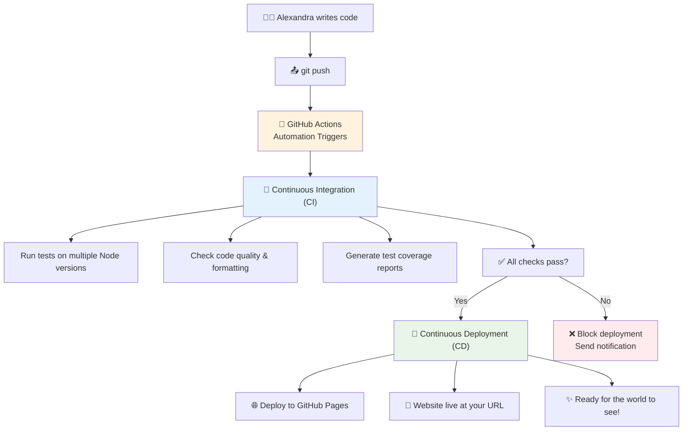
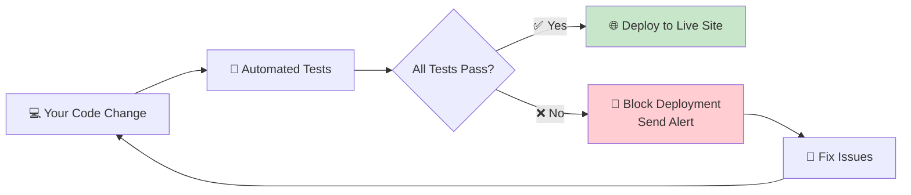

# 🚀 CI/CD & GitHub Actions - Your Invisible Development Team

*Understanding the automation that's already working for you*

## 🤯 You're Already Using Enterprise-Level Automation!

**Did you know?** Every time you push code to GitHub, an invisible team of robots springs into action to:
- ✅ **Test your code** on multiple versions of Node.js
- 🔍 **Check code quality** with linting and formatting
- 📊 **Generate coverage reports** to track test quality
- 🌐 **Deploy your website** automatically to the internet
- 🛡️ **Protect the main branch** from broken code

**This is called CI/CD** - and you're using the same automation as companies like Google, Netflix, and Spotify!

## 🎯 What is CI/CD?



**CI (Continuous Integration):** Automatically testing and validating every code change
**CD (Continuous Deployment):** Automatically deploying working code to production

## 🔍 What Happens When You Push Code

**Let's trace what happens when you run `git push`:**

### 1. **GitHub Receives Your Code** 📤
```bash
git push origin main
```
GitHub detects new commits and triggers your workflows.

### 2. **Tests Workflow Starts** 🧪
Your `.github/workflows/tests.yml` file springs into action:

```yaml
# Runs on every push to main/develop and every pull request
on:
  push:
    branches: [ main, develop ]
  pull_request:
    branches: [ main ]
```

### 3. **Multi-Environment Testing** 🌐
Your code gets tested on **3 different Node.js versions**:
- Node 16.x (LTS)
- Node 18.x (Current LTS)  
- Node 20.x (Latest)

**Why?** Ensures your code works for users with different Node.js versions!

### 4. **Quality Checks Run** ✨
**Every single push automatically runs:**
```bash
npm run lint          # Check code quality
npm run format:check  # Verify formatting
npm test              # Run all tests
npm run test:coverage # Generate coverage report
```

### 5. **Coverage Analysis** 📊
Your test coverage gets analyzed and uploaded to Codecov - showing exactly which parts of your code are tested.

### 6. **Deployment (If All Passes)** 🚀
If everything passes, your `.github/workflows/deploy.yml` automatically:
- Deploys your website to GitHub Pages
- Makes it live at your GitHub Pages URL
- Updates within minutes of your push!

## 🛡️ How This Protects Your Code

### **The Safety Net**


**This automation prevents:**
- 🐛 **Broken code** from reaching your live website
- 💥 **Regressions** that break existing functionality  
- 🎨 **Inconsistent formatting** across your codebase
- 📉 **Quality degradation** over time

## 🏢 Why This is Professional Development

**This setup is identical to what you'd find at:**

### **Google/YouTube:**
- Every code change runs thousands of automated tests
- Nothing deploys without passing quality gates
- Multiple environments ensure compatibility

### **Netflix:**
- Continuous deployment enables rapid feature releases
- Automated testing prevents service outages
- Quality metrics track code health

### **Spotify:**
- CI/CD enables teams to deploy multiple times per day
- Automated checks maintain code quality at scale
- Coverage tracking ensures comprehensive testing

## 🎮 Your CI/CD Dashboard

**Want to see your automation in action?**

### **1. Check GitHub Actions Tab**
1. Go to your GitHub repository
2. Click the "Actions" tab
3. See all your automated workflows!

### **2. Watch a Workflow Run**
1. Make a small change to your code
2. Push it: `git push`
3. Immediately go to Actions tab
4. Watch the real-time progress! 🍿

### **3. Understanding the Status Icons**
- 🟢 **Green checkmark** - All automation passed
- 🔴 **Red X** - Something failed (needs attention)
- 🟡 **Yellow circle** - Currently running
- ⚪ **Gray circle** - Queued/waiting

## 🔧 Your Automation Configuration

**Let's understand what you have configured:**

### **tests.yml - Your Quality Guardian**
```yaml
name: Tests

# When to run: every push to main/develop, every pull request
on:
  push:
    branches: [ main, develop ]
  pull_request:
    branches: [ main ]

jobs:
  test:
    runs-on: ubuntu-latest
    
    # Test on multiple Node.js versions
    strategy:
      matrix:
        node-version: [16.x, 18.x, 20.x]
    
    steps:
    - uses: actions/checkout@v3    # Get your code
    - name: Use Node.js            # Set up Node.js
    - name: Cache dependencies     # Speed up builds
    - name: Install dependencies   # npm ci
    - name: Run linter            # Check code quality
    - name: Check code formatting # Verify Prettier
    - name: Run tests             # Execute Jest tests
    - name: Generate coverage     # Create coverage report
    - name: Upload coverage       # Send to Codecov
```

### **deploy.yml - Your Publishing Assistant**
```yaml
name: Deploy to GitHub Pages

# When to run: every push to main branch
on:
  push:
    branches: [ main ]

jobs:
  deploy:
    environment:
      name: github-pages
      url: ${{ steps.deployment.outputs.page_url }}
    
    steps:
    - name: Checkout              # Get your code
    - name: Setup Pages          # Configure GitHub Pages
    - name: Upload artifact      # Prepare files
    - name: Deploy to GitHub Pages # Make it live!
```

## 📊 Understanding Your Test Coverage

**Coverage tells you what percentage of your code is tested:**

```javascript
// This function is 100% covered if you test all paths
function fizzbuzz(number) {
  if (number % 3 === 0 && number % 5 === 0) return 'FizzBuzz'; // ✅ Tested
  if (number % 3 === 0) return 'Fizz';                        // ✅ Tested  
  if (number % 5 === 0) return 'Buzz';                        // ✅ Tested
  return number.toString();                                    // ✅ Tested
}
```

**Coverage metrics:**
- **Lines:** Percentage of code lines executed
- **Functions:** Percentage of functions called
- **Branches:** Percentage of if/else paths taken
- **Statements:** Percentage of statements executed

**Good coverage = confidence in your code!**

## 🎯 CI/CD Best Practices You're Already Following

### ✅ **Automated Testing**
Every code change gets tested automatically - no manual work required!

### ✅ **Multi-Environment Testing**  
Testing on Node 16, 18, and 20 ensures compatibility.

### ✅ **Quality Gates**
Code must pass linting, formatting, and tests before deployment.

### ✅ **Fast Feedback**
Know within minutes if your change broke something.

### ✅ **Automated Deployment**
Working code automatically goes live - no manual deployment steps.

### ✅ **Coverage Tracking**
Monitor test quality over time with coverage reports.

## 🚀 Advanced CI/CD Concepts

### **Branch Protection Rules**
Your repository can be configured to:
- ✅ Require all checks to pass before merging
- ✅ Require code reviews from teammates
- ✅ Prevent direct pushes to main branch
- ✅ Keep history linear and clean

### **Environment-Specific Deployments**
Professional setups often have:
- **Development** - Latest code for testing
- **Staging** - Pre-production environment  
- **Production** - Live code users see

### **Blue-Green Deployments**
Advanced technique where you have two identical environments and switch between them for zero-downtime deployments.

## 🛠️ Extending Your CI/CD

**Want to add more automation? Here are ideas:**

### **1. Dependency Updates**
```yaml
# Automatically update dependencies
- name: Update dependencies
  uses: actions/dependabot@v1
```

### **2. Performance Testing**  
```yaml
# Run performance benchmarks
- name: Performance tests
  run: npm run test:performance
```

### **3. Security Scanning**
```yaml
# Check for security vulnerabilities
- name: Security audit
  run: npm audit
```

### **4. Visual Regression Testing**
```yaml
# Test UI changes don't break design
- name: Screenshot tests  
  run: npm run test:visual
```

## 🔍 Debugging Failed CI/CD

**When the automation catches a problem:**

### **1. Check the Actions Tab**
- See exactly which step failed
- Read the error messages
- Look at the logs

### **2. Common Failure Reasons**
- 🧪 **Test failures** - A test is failing
- 📏 **Lint errors** - Code quality issues
- 🎨 **Formatting issues** - Run `npm run format`
- 📦 **Dependency problems** - Package installation failed

### **3. Fix and Push Again**
```bash
# Fix the issue locally
npm test          # Make sure it works
npm run lint      # Check quality
npm run format    # Fix formatting

# Push the fix
git add .
git commit -m "fix: resolve CI issues"
git push
```

## 🌟 The Magic of Automation

**Think about what you used to do manually:**
- ❌ Remember to run tests before pushing
- ❌ Check code formatting manually  
- ❌ Deploy website by uploading files
- ❌ Worry about breaking the live site

**Now it's all automated:**
- ✅ Tests run automatically on every push
- ✅ Formatting is checked consistently
- ✅ Website deploys automatically when ready
- ✅ Broken code never reaches production

**This is the power of CI/CD!** 🚀

## 🎊 You're Already a Professional Developer!

**The automation you're using includes:**
- ✅ **Multi-environment testing** (Node 16/18/20)
- ✅ **Quality gates** (linting, formatting, tests)
- ✅ **Coverage tracking** (Codecov integration)
- ✅ **Automated deployment** (GitHub Pages)
- ✅ **Fast feedback loops** (immediate notifications)
- ✅ **Professional workflows** (same as top tech companies)

**This is exactly how software is built at:**
- Google, Netflix, Spotify, Airbnb, Uber...
- Every modern tech company
- Open source projects with millions of users

## 🚀 Your Next Steps

**Now that you understand your automation:**

### **1. Watch It Work**
- Push a small change
- Watch the Actions tab in real-time
- See your automation in action!

### **2. Experiment Safely**
- Try breaking a test intentionally
- See how CI prevents deployment
- Fix it and watch deployment resume

### **3. Appreciate the Magic**
- Every green checkmark is validation
- Every automatic deployment is convenience
- Every caught bug is protection

### **4. Share Your Knowledge**
- Show friends your automated setup
- Explain how professional development works
- Help others set up similar automation

## 🌟 The Future of Development

**You're experiencing the future of software development:**
- **AI-assisted coding** with tools like GitHub Copilot
- **Automated testing** that you're already using
- **Continuous deployment** without human intervention  
- **Quality gates** that maintain code health
- **Global collaboration** through version control

**Welcome to modern software development, Alexandra!** 🎉

---

**[← Back to Main Journey](../START_HERE.md)**

> *"Automation is not about replacing humans; it's about amplifying human capabilities."*

**You now understand the invisible team working behind the scenes to make your development process professional, safe, and efficient!** 🤖⚡✨