# 👥 Code Review Process & Professional Collaboration

*Master the art of collaborative development and professional code review*

## 🎯 The Power of Code Review

**Code review is more than finding bugs:**
- 🧠 **Knowledge sharing** - Learn from each other
- 🛡️ **Quality assurance** - Catch issues before production
- 📚 **Mentorship** - Grow together as developers
- 🏗️ **Architecture alignment** - Maintain consistent standards
- 🤝 **Team collaboration** - Build shared understanding

```mermaid
graph LR
    A["👤 Individual<br/>Code in isolation"] --> B["👥 Collaborative<br/>Code with review"]
    B --> C["🏢 Professional<br/>Team excellence"]
    
    A --> A1["Higher bug rates<br/>Inconsistent style"]
    B --> B1["Shared knowledge<br/>Quality improvements"]
    C --> C1["Scalable teams<br/>Sustainable growth"]
    
    style C fill:#c8e6c9
```



## 🚀 Code Review in Your FizzBuzz Project

### **Setting Up Pull Request Workflow**

**1. Create a feature branch:**
```bash
# Start from clean main branch
git checkout main
git pull origin main

# Create feature branch
git checkout -b feature/fizzbuzz-enhancements

# Make your changes
# ... edit files ...

# Commit changes
git add .
git commit -m "feat: add edge case handling to FizzBuzz

- Handle negative numbers correctly
- Add input validation
- Improve error messages"

# Push to remote
git push -u origin feature/fizzbuzz-enhancements
```

**2. Create Pull Request:**
```bash
# Using GitHub CLI
gh pr create \
  --title "Add FizzBuzz edge case handling" \
  --body "$(cat <<'EOF'
## Summary
Enhances the FizzBuzz function to handle edge cases and improve robustness.

## Changes
- ✅ Add input validation for non-numbers
- ✅ Handle negative numbers appropriately  
- ✅ Add comprehensive test coverage
- ✅ Update error handling

## Test Plan
- [x] All existing tests pass
- [x] New edge case tests added
- [x] Manual testing with invalid inputs
- [x] Performance impact verified

## Screenshots
[Include before/after if applicable]

🤖 Generated with [Claude Code](https://claude.ai/code)
EOF
)"
```

### **Your Pull Request Template**

**Create `.github/pull_request_template.md`:**
```markdown
## Summary
Brief description of changes made.

## Type of Change
- [ ] 🐛 Bug fix (non-breaking change which fixes an issue)
- [ ] ✨ New feature (non-breaking change which adds functionality)
- [ ] 💥 Breaking change (fix or feature that would cause existing functionality to not work as expected)
- [ ] 📚 Documentation update
- [ ] 🎨 Style/formatting changes
- [ ] ♻️ Refactoring (no functional changes)
- [ ] ⚡ Performance improvements
- [ ] 🧪 Test additions/updates

## Changes Made
- 
- 
- 

## Testing
- [ ] All existing tests pass
- [ ] New tests added for new functionality
- [ ] Manual testing completed
- [ ] Performance impact considered

## Checklist
- [ ] My code follows the project's style guidelines
- [ ] I have performed a self-review of my own code
- [ ] I have commented my code, particularly in hard-to-understand areas
- [ ] I have made corresponding changes to the documentation
- [ ] My changes generate no new warnings
- [ ] Any dependent changes have been merged and published

## Screenshots/Demo
[Add screenshots or demo links if applicable]

## Related Issues
Closes #[issue number]
```

## 🔍 Effective Code Review Practices

### **As a Code Author**

**Before Submitting for Review:**

```javascript
// ✅ Good: Self-reviewed code with clear intent
/**
 * Enhanced FizzBuzz with input validation
 * @param {number} number - The number to process
 * @returns {string} - FizzBuzz result or error message
 * @throws {TypeError} - When input is not a number
 */
function fizzbuzz(number) {
  // Input validation
  if (typeof number !== 'number' || isNaN(number)) {
    throw new TypeError('Input must be a valid number');
  }
  
  // Handle the classic FizzBuzz logic
  if (number % 15 === 0) return 'FizzBuzz';
  if (number % 3 === 0) return 'Fizz';
  if (number % 5 === 0) return 'Buzz';
  
  return number.toString();
}

// ❌ Avoid: Unclear code without context
function fb(n) {
  return n%15?n%5?n%3?n:'Fizz':'Buzz':'FizzBuzz';
}
```

**Self-Review Checklist:**
- [ ] **Code clarity** - Would a new teammate understand this?
- [ ] **Test coverage** - Are all paths tested?
- [ ] **Performance** - Any obvious inefficiencies?
- [ ] **Error handling** - How does it handle edge cases?
- [ ] **Documentation** - Are complex parts explained?
- [ ] **Style consistency** - Follows project conventions?

### **As a Code Reviewer**

**Review Focus Areas:**

**1. Functionality & Logic:**
```javascript
// Reviewer comment: "Consider edge case"
function fizzbuzz(number) {
  if (number % 3 === 0 && number % 5 === 0) {
    return 'FizzBuzz';
  }
  // 💬 What happens with number = 0? 
  // 0 % 3 === 0 and 0 % 5 === 0, so this returns 'FizzBuzz'
  // Is this the intended behavior?
}
```

**2. Code Quality & Maintainability:**
```javascript
// 💬 Consider extracting magic numbers to constants
const FIZZ_DIVISOR = 3;
const BUZZ_DIVISOR = 5;

function fizzbuzz(number) {
  if (number % FIZZ_DIVISOR === 0 && number % BUZZ_DIVISOR === 0) {
    return 'FizzBuzz';
  }
  // This makes the logic more maintainable
}
```

**3. Test Quality:**
```javascript
// 💬 Great test coverage! Consider adding these edge cases:
describe('FizzBuzz edge cases', () => {
  test('handles zero correctly', () => {
    expect(fizzbuzz(0)).toBe('FizzBuzz'); // Or should this throw?
  });
  
  test('handles negative multiples', () => {
    expect(fizzbuzz(-3)).toBe('Fizz');
    expect(fizzbuzz(-15)).toBe('FizzBuzz');
  });
  
  test('handles large numbers', () => {
    expect(fizzbuzz(999999)).toBe('Fizz');
  });
});
```

**4. Performance Considerations:**
```javascript
// 💬 For large ranges, consider caching or optimization
function fizzbuzzRange(start, end) {
  const results = [];
  
  // Potential optimization: pre-calculate patterns
  for (let i = start; i <= end; i++) {
    results.push(fizzbuzz(i));
  }
  
  return results;
}
```

## 📝 Review Comment Guidelines

### **Constructive Feedback Patterns**

**✅ Effective Comments:**
```
💬 "Consider using const instead of let here since the value doesn't change."

💬 "This function is doing two things. What do you think about splitting 
    the validation and logic into separate functions?"

💬 "Great solution! I learned something new from your approach. 
    One small suggestion: could we add a comment explaining the algorithm?"

💬 "This works perfectly! For future enhancement, we might want to 
    consider making the divisors configurable (3, 5, 7, etc.)"
```

**❌ Ineffective Comments:**
```
💬 "This is wrong." (No explanation or suggestion)

💬 "Why did you do it this way?" (Sounds accusatory)

💬 "This is confusing." (Not specific or helpful)

💬 "Just use constants." (Too terse, no context)
```

### **Comment Categories with Examples**

**🐛 Bug/Issue:**
```
🐛 This will throw an error when number is null. 
   Consider adding: if (number == null) return 'Invalid';
```

**💡 Suggestion:**
```
💡 Consider using template literals for consistency:
   return `${i}: ${result}` instead of i + ': ' + result
```

**❓ Question:**
```
❓ Is this handling negative numbers the way we want? 
   fizzbuzz(-15) currently returns 'FizzBuzz' - is that expected?
```

**👍 Praise:**
```
👍 Excellent test coverage! The edge cases you've covered will 
   prevent many potential bugs.
```

**📚 Learning:**
```
📚 TIL: I didn't know about the Number.isInteger() method. 
   That's a great way to validate input!
```

**🏗️ Architecture:**
```
🏗️ This function is getting complex. Consider the Single Responsibility 
   Principle - maybe split validation and logic?
```

## 🛠️ Tools for Code Review

### **GitHub Review Features**

**1. Line-by-Line Comments:**
```javascript
function fizzbuzz(number) {
  if (number % 3 === 0 && number % 5 === 0) {
    return 'FizzBuzz';              // 💬 Click '+' to add comment
  }
  if (number % 3 === 0) {
    return 'Fizz';                  // 💬 Suggestion: Extract to constant
  }
  if (number % 5 === 0) {
    return 'Buzz';                  // 💬 Same divisor check pattern
  }
  return number.toString();
}
```

**2. Code Suggestions:**
```javascript
// In GitHub, you can suggest specific changes:
```suggestion
const FIZZ_DIVISOR = 3;
const BUZZ_DIVISOR = 5;

function fizzbuzz(number) {
  if (number % FIZZ_DIVISOR === 0 && number % BUZZ_DIVISOR === 0) {
    return 'FizzBuzz';
  }
```

**3. Review Status:**
- ✅ **Approve** - Code is ready to merge
- 💬 **Comment** - Feedback without blocking
- 📝 **Request Changes** - Issues must be addressed

### **Automated Review Tools**

**ESLint for Code Style:**
```json
// .eslintrc.json - automated style checking
{
  "extends": ["eslint:recommended"],
  "rules": {
    "no-console": "warn",
    "no-unused-vars": "error",
    "prefer-const": "error",
    "no-var": "error",
    "eqeqeq": "error"
  }
}
```

**Prettier for Formatting:**
```json
// .prettierrc - automated formatting
{
  "singleQuote": true,
  "trailingComma": "es5",
  "tabWidth": 2,
  "semi": true,
  "printWidth": 80
}
```

**Husky for Pre-commit Hooks:**
```json
// package.json
{
  "husky": {
    "hooks": {
      "pre-commit": "lint-staged",
      "pre-push": "npm test"
    }
  },
  "lint-staged": {
    "*.js": ["eslint --fix", "prettier --write", "git add"]
  }
}
```

## 🎯 Review Workflows

### **Standard Review Process**

```mermaid
graph TD
    A["👤 Create Feature Branch"] --> B["💻 Write Code"]
    B --> C["🧪 Add Tests"]
    C --> D["✅ Self Review"]
    D --> E["📤 Create Pull Request"]
    E --> F["👥 Team Review"]
    F --> G{Review Status}
    G -->|Approved| H["🎉 Merge to Main"]
    G -->|Changes Requested| I["🔧 Address Feedback"]
    I --> J["📝 Update PR"]
    J --> F
    H --> K["🚀 Deploy"]
    
    style H fill:#c8e6c9
    style K fill:#c8e6c9
```



### **Review Assignment Strategies**

**1. Round Robin:**
```javascript
// Assign reviews in rotation
const reviewers = ['alice', 'bob', 'charlie'];
const prAuthor = 'diana';
const assignedReviewer = reviewers.filter(r => r !== prAuthor)[0];
```

**2. Expertise-Based:**
```javascript
// Assign based on code area
const codeAreas = {
  'src/': ['backend-expert'],
  'test/': ['testing-expert'],
  'docs/': ['documentation-expert'],
  'style.css': ['frontend-expert']
};
```

**3. Pair Review:**
- Senior + Junior reviewer for mentorship
- Domain expert + Fresh eyes for balance

### **Review Metrics & Quality**

**Tracking Review Effectiveness:**
```javascript
const reviewMetrics = {
  timeToFirstReview: '< 4 hours',
  timeToMerge: '< 1 day',
  reviewCoverage: '100% of PRs reviewed',
  defectEscapeRate: '< 5% bugs reach production',
  reviewParticipation: 'All team members review'
};
```

## 🏆 Advanced Review Techniques

### **Architecture Review**

**For larger changes, review system design:**
```javascript
/**
 * 🏗️ Architecture Review Checklist:
 * 
 * 1. Does this fit our overall architecture?
 * 2. Are we introducing new dependencies unnecessarily?
 * 3. How does this scale?
 * 4. What are the failure modes?
 * 5. Is this the simplest solution that works?
 */

// Example: Reviewing a new feature architecture
class FizzBuzzProcessor {
  constructor(rules = []) {
    this.rules = rules; // 💬 Good: Configurable rules
  }
  
  process(number) {
    // 💬 Consider: What if rules conflict?
    // 💬 Consider: Performance with many rules?
  }
}
```

### **Security Review**

**Security considerations in code review:**
```javascript
// 🔒 Security Review Focus Areas

function processUserInput(input) {
  // ⚠️ Security: Validate and sanitize user input
  if (typeof input !== 'number' || !Number.isFinite(input)) {
    throw new Error('Invalid input');
  }
  
  // ⚠️ Security: Prevent denial of service
  if (Math.abs(input) > Number.MAX_SAFE_INTEGER) {
    throw new Error('Number too large');
  }
  
  return fizzbuzz(input);
}

// 🔒 Security Checklist:
// - Input validation
// - Output sanitization  
// - Resource limits
// - Error information disclosure
// - Authentication/authorization
```

### **Performance Review**

**Performance-focused review:**
```javascript
// ⚡ Performance Review Example

// Before: O(n) for each call
function fizzbuzzSlow(number) {
  const rules = [
    { divisor: 3, word: 'Fizz' },
    { divisor: 5, word: 'Buzz' }
  ];
  // ... process rules
}

// After: Rules cached
const FIZZBUZZ_RULES = [
  { divisor: 3, word: 'Fizz' },
  { divisor: 5, word: 'Buzz' }
];

function fizzbuzzFast(number) {
  // 💬 Good: Reusing pre-computed rules
  // 💬 Consider: For very high frequency, precompute common results
}
```

## 📚 Code Review Culture

### **Building Positive Review Culture**

**1. Psychological Safety:**
- Mistakes are learning opportunities
- Focus on code, not coder
- Encourage questions and discussions
- Celebrate good solutions

**2. Continuous Learning:**
```javascript
// 📚 Share knowledge through reviews
function fizzbuzz(number) {
  // 💬 TIL: Using bitwise AND for even faster modulo check
  // if ((number & 1) === 0) // checks if even
  
  // 💬 Learning: Template literals improve readability
  return `Result for ${number}: ${result}`;
}
```

**3. Standards Evolution:**
- Review guidelines evolve with team
- Document learnings from reviews
- Regular retrospectives on review process

### **Review Anti-Patterns to Avoid**

**❌ Nitpicking:**
```
💬 "Use single quotes instead of double quotes here"
(When it doesn't matter for functionality)
```

**❌ Design by Committee:**
```
💬 "Let's completely rewrite this using a different approach"
(Major architectural changes during review)
```

**❌ Personal Preferences:**
```
💬 "I would have done this differently"
(Without explaining why it's better)
```

**❌ Late Review:**
```
Reviewing a 2-week-old PR with extensive changes
(Review should be timely)
```

## 🎊 Your Code Review Superpowers

**You now understand:**
- 🤝 **Collaborative development** workflows and practices
- 📝 **Effective feedback** techniques for constructive reviews
- 🛠️ **Professional tools** for streamlined review process
- 🏗️ **Architecture review** principles for system quality
- 🔒 **Security considerations** in collaborative development
- 📊 **Review metrics** and continuous improvement

**This knowledge enables:**
- 🌟 **Higher code quality** through collaborative improvement
- 🚀 **Faster development** with efficient review workflows  
- 🧠 **Knowledge sharing** and team skill development
- 🛡️ **Risk reduction** through multiple perspectives
- 🤝 **Stronger teams** through positive review culture

## 🌟 Practice Code Review on Your FizzBuzz

**Apply your new skills:**

1. **Self-Review:** Review your current FizzBuzz implementation
2. **Create PR:** Make a small improvement via pull request
3. **Mock Review:** Write review comments for your own code
4. **Process Setup:** Configure review templates and automation
5. **Documentation:** Create team standards document

**Example Self-Review Exercise:**
```javascript
// Review this code as if you're reviewing a teammate's work:
function fizzbuzz(number) {
  if (number % 3 == 0 && number % 5 == 0) {
    return 'FizzBuzz';
  }
  if (number % 3 == 0) {
    return 'Fizz';
  }
  if (number % 5 == 0) {
    return 'Buzz';
  }
  return number.toString();
}
```

**What would you comment on?**
- Use `===` instead of `==` for strict equality
- Consider extracting magic numbers (3, 5) to constants
- Add input validation for edge cases
- Add JSDoc documentation
- Consider performance for large ranges

---

**[← Back to Main Journey](../START_HERE.md)**

> *"Code review is not about finding faults; it's about raising the bar for everyone."* - Unknown

**Fantastic work, Alexandra!** You now have professional code review skills that will make you an invaluable team member! 👥🔍✨