# ✍️ Writing Professional Commit Messages

*Master the art of Git communication that tells the story of your code*

## 🎯 Why Commit Messages Matter

**Your commit messages are:**
- 📖 **Documentation** - The history of your project's evolution
- 🔍 **Searchable context** - Find specific changes months later
- 🐛 **Debugging tools** - Understand why changes were made
- 🤝 **Team communication** - Share intent with collaborators
- 📚 **Learning resources** - Future developers understand decisions

```mermaid
graph LR
    A["❌ Bad History<br/>git log confusion"] --> B["✅ Good History<br/>Clear project story"]
    
    A --> A1["'fixed stuff'<br/>'updated files'<br/>'asdfasdf'"]
    B --> B1["Clear titles<br/>Explanatory bodies<br/>Linked issues"]
    
    style B fill:#c8e6c9
```



## 📝 The Anatomy of a Perfect Commit Message

### **The Standard Format**

```
<type>: <subject> (50 chars or less)

<body> (Wrap at 72 characters)
Explain WHY this change was necessary, not just what changed.
The code shows WHAT changed; the message explains WHY.

<footer> (Optional references, issues, breaking changes)
```

### **Real Example from Your FizzBuzz Project**

```bash
# ✅ GOOD - Professional commit message
git commit -m "fix: handle zero input in FizzBuzz function

Previously, fizzbuzz(0) would return 'FizzBuzz' since 0 % 3 === 0 
and 0 % 5 === 0. This was technically correct but confusing for users 
who expected zero to be invalid input.

Added explicit check for zero to return '0' as string, maintaining 
consistency with the string return type while providing clearer 
behavior for this edge case.

This improves user experience and prevents confusion in production."

# ❌ BAD - Unclear commit message
git commit -m "fixed fizzbuzz"
```

## 🎨 The Seven Rules of Great Commit Messages

### **1. Separate Subject from Body with Blank Line**

```bash
# ✅ GOOD
feat: add input validation to FizzBuzz function
                                                  # <- Blank line here!
Input validation prevents runtime errors when non-numeric values 
are passed. This improves robustness and user experience by providing
clear error messages instead of silent failures.

# ❌ BAD
feat: add input validation to FizzBuzz function
Input validation prevents runtime errors...  # No blank line!
```

### **2. Limit Subject Line to 50 Characters**

```bash
# ✅ GOOD (48 chars)
fix: prevent negative numbers in FizzBuzz logic

# ❌ BAD (72 chars) 
fix: prevent negative numbers from being processed in the FizzBuzz function logic
```

**Why 50 characters?**
- GitHub truncates at 72 characters
- `git log --oneline` shows ~50 chars comfortably
- Forces you to think about the essence of the change

### **3. Capitalize the Subject Line**

```bash
# ✅ GOOD
Fix: resolve edge case with decimal inputs

# ❌ BAD
fix: resolve edge case with decimal inputs
```

### **4. Don't End Subject with Period**

```bash
# ✅ GOOD
feat: implement FizzBuzz range function

# ❌ BAD
feat: implement FizzBuzz range function.
```

### **5. Use Imperative Mood in Subject**

**Think: "If applied, this commit will..."**

```bash
# ✅ GOOD - Imperative mood
Add error handling for invalid inputs
Fix memory leak in loop iteration
Update dependencies to latest versions
Remove deprecated validation function

# ❌ BAD - Other moods
Added error handling for invalid inputs      # Past tense
Adds error handling for invalid inputs       # Present tense
Adding error handling for invalid inputs     # Continuous
This adds error handling for invalid inputs  # Descriptive
```

**Mental model:** Your commit message completes this sentence:
> "If applied, this commit will **[your subject line]**"

### **6. Wrap Body at 72 Characters**

```bash
# ✅ GOOD - Wrapped at 72 characters
The previous implementation would fail silently when given decimal
inputs like 3.14. This was problematic because users wouldn't know
their input was invalid.

This commit adds explicit type checking to ensure only integers are
processed, throwing a descriptive error for invalid inputs.

# ❌ BAD - No wrapping
The previous implementation would fail silently when given decimal inputs like 3.14. This was problematic because users wouldn't know their input was invalid. This commit adds explicit type checking to ensure only integers are processed.
```

### **7. Explain WHY, not WHAT**

```bash
# ✅ GOOD - Explains WHY
refactor: extract divisibility logic to separate functions

The FizzBuzz function was becoming difficult to test in isolation
due to tightly coupled logic. Extracting isDivisibleBy() helpers
allows unit testing of divisibility logic separately from the main
function logic, improving maintainability and test coverage.

This also makes the code more readable by giving names to the
concepts, replacing magic numbers with semantic function calls.

# ❌ BAD - Only explains WHAT (which the diff already shows)
refactor: extract divisibility logic to separate functions

Created isDivisibleBy3() and isDivisibleBy5() functions.
Moved modulo checks into these functions.
Updated main function to call new functions.
```

## 🏷️ Conventional Commit Types

### **Standard Types and When to Use Them**

```bash
feat:     # New feature for the user
fix:      # Bug fix for the user
docs:     # Documentation only changes
style:    # Formatting, missing semicolons, etc (no code change)
refactor: # Code change that neither fixes bug nor adds feature
perf:     # Performance improvement
test:     # Adding missing tests or correcting existing ones
build:    # Changes to build system or dependencies
ci:       # Changes to CI configuration files and scripts
chore:    # Updating grunt tasks etc (no production code change)
revert:   # Reverts a previous commit
```

### **Examples for Your FizzBuzz Project**

```bash
# Feature
feat: add web interface for FizzBuzz visualization

# Bug Fix
fix: correct FizzBuzz logic for number 15

# Documentation
docs: add TDD tutorial for beginners

# Style
style: format code with Prettier standards

# Refactoring
refactor: simplify conditional logic using early returns

# Performance
perf: optimize FizzBuzz for large number ranges

# Test
test: add edge case coverage for negative numbers

# Build
build: update Jest to version 29 for better performance

# CI/CD
ci: add automated testing workflow with GitHub Actions

# Chore
chore: update .gitignore to exclude coverage reports

# Revert
revert: revert "feat: add experimental caching"

This reverts commit abc123def456 which caused memory leaks
in production environment.
```

## 📊 Commit Message Patterns for Different Scenarios

### **Bug Fix Pattern**

```bash
fix: prevent infinite loop when limit is negative

The generateFizzBuzzRange function would enter an infinite loop when 
given a negative limit because the loop condition (i <= limit) would 
never be false when incrementing from 1.

Added validation to ensure limit is positive, throwing a descriptive
error for invalid inputs. This prevents the browser from freezing and
provides clear feedback to developers.

Fixes #42
```

### **Feature Addition Pattern**

```bash
feat: implement configurable FizzBuzz rules

Users requested ability to customize FizzBuzz with their own rules
beyond the traditional 3/5 divisors. This enables educational 
scenarios where teachers can create variations like 7="Pop".

The implementation uses a rules array that maintains backward 
compatibility while enabling extensibility. Default behavior remains
unchanged when no custom rules are provided.

Closes #23
```

### **Breaking Change Pattern**

```bash
feat!: change FizzBuzz to return array instead of string

BREAKING CHANGE: fizzbuzz() now returns an array of results rather 
than a concatenated string. This improves programmatic consumption
of results and enables better integration with web interfaces.

Migration guide:
- Before: fizzbuzz(15) returned "1 2 Fizz 4 Buzz..."
- After: fizzbuzz(15) returns ["1", "2", "Fizz", "4", "Buzz"...]
- Use results.join(" ") to get previous string format

This change enables better data manipulation and display flexibility
requested by multiple users for dashboard integrations.
```

### **Refactoring Pattern**

```bash
refactor: extract magic numbers to named constants

Magic numbers (3, 5, 15) scattered throughout the codebase made the
business logic unclear and maintenance difficult. When reviewing code,
it wasn't immediately obvious why these specific values were chosen.

Extracting to FIZZ_DIVISOR and BUZZ_DIVISOR constants makes the code
self-documenting and enables easy configuration changes if needed.
This also improves searchability when looking for business rules.

No functional changes - all tests still pass.
```

### **Performance Improvement Pattern**

```bash
perf: cache FizzBuzz results for repeated calls

Profiling showed that fizzbuzzRange() was being called multiple times
with the same parameters during re-renders, causing unnecessary 
computation for large ranges (10000+ numbers).

Implemented memoization using a WeakMap to cache results. This reduces
computation time by 95% for repeated calls while maintaining a small
memory footprint through weak references.

Benchmark results:
- Before: 1000ms for range(1, 100000) on each call
- After: 1000ms first call, <5ms for cached calls
```

## 🎯 Interactive Commit Messages

### **Multi-line Commits in Terminal**

```bash
# Method 1: Using -m multiple times
git commit -m "feat: add input validation" \
           -m "" \
           -m "Previously, invalid inputs would cause cryptic errors deep" \
           -m "in the function logic. This was confusing for users and made" \
           -m "debugging difficult." \
           -m "" \
           -m "Added upfront validation with clear error messages that" \
           -m "immediately indicate what went wrong and how to fix it."

# Method 2: Using editor (recommended)
git config --global core.editor "code --wait"  # Set VS Code as editor
git commit  # Opens VS Code for message

# Method 3: Using heredoc
git commit -m "$(cat <<'EOF'
feat: add comprehensive error handling

The application would crash silently when encountering unexpected
inputs, leaving users confused about what went wrong.

This commit adds try-catch blocks with descriptive error messages,
graceful fallbacks, and user-friendly error display. Errors are now
logged for debugging while showing helpful messages to users.

Improves user experience and reduces support requests.
EOF
)"
```

### **Commit Message Templates**

**Create `.gitmessage` template:**
```bash
# Subject line (50 chars or less)
# Example: feat: add new feature

# Body (wrap at 72 chars)
# Explain WHY this change is necessary


# Footer (optional)
# Fixes: #123
# Refs: #456
# BREAKING CHANGE: description
```

**Configure Git to use template:**
```bash
git config --global commit.template ~/.gitmessage
```

## 📈 Commit Message Quality Checklist

### **Before You Commit**

- [ ] **Subject ≤ 50 characters?**
- [ ] **Imperative mood used?**
- [ ] **Type prefix included?**
- [ ] **Body explains WHY?**
- [ ] **Lines wrapped at 72 chars?**
- [ ] **Related issues referenced?**
- [ ] **Would a new team member understand?**

### **Quality Examples from Your Project**

```bash
# ⭐ EXCELLENT
test: add coverage for FizzBuzz edge cases

Discovered that our test suite wasn't catching several edge cases
that could cause issues in production:
- Negative numbers returned unexpected results  
- Decimal inputs weren't validated
- Very large numbers caused overflow

Added comprehensive test cases to prevent regressions and ensure
robust behavior across all input types. This brings coverage from
85% to 98% and prevents the bugs we saw in production last week.

Fixes #15, #16, #17

# ✅ GOOD
docs: update README with clearer setup instructions

New developers were struggling with initial setup based on feedback
from onboarding sessions. Simplified instructions and added 
troubleshooting section.

# ⚠️ OKAY
fix: handle null input

Null input caused error. Now returns "Invalid".

# ❌ POOR
updated stuff

# ❌ TERRIBLE
asdfasdf
```

## 🔍 Searching and Using Commit History

### **Finding Commits with Good Messages**

```bash
# Find all features added
git log --grep="^feat:" --oneline

# Find why a line was changed
git blame src/fizzbuzz.js
git show <commit-hash>  # Read the WHY in the message

# Find commits by author about specific topic
git log --author="Alexandra" --grep="validation"

# Find when bug was introduced (with good messages)
git bisect start
git bisect bad  # Current version is bad
git bisect good abc123  # Known good commit
# Git uses commit messages to help identify problem
```

### **Generating Changelogs from Good Messages**

```bash
# Generate changelog from conventional commits
git log --pretty=format:"- %s" --grep="^feat:" v1.0.0..HEAD > CHANGELOG.md

# Output:
# - feat: add web interface for FizzBuzz
# - feat: implement range generation
# - feat: add input validation
```

## 🎨 Your FizzBuzz Commit Message Evolution

### **Track Your Progress**

```bash
# Your first commit (learning)
Initial commit

# Early commits (getting better)
fix bug
add test
update function

# Current commits (good!)
fix: handle edge case for zero input
test: add coverage for negative numbers
docs: explain TDD process in README

# Future commits (professional!)
feat: implement configurable FizzBuzz rules

The traditional FizzBuzz with fixed 3/5 divisors doesn't allow for
educational variations. Teachers requested ability to create custom
challenges with different numbers and words.

Implemented a rules-based system that accepts an array of 
{divisor, word} objects while maintaining backward compatibility.
This enables creative variations while preserving the classic game.

Example: [{divisor: 7, word: "Pop"}] adds a new rule.

Closes #42
Co-authored-by: TeammateName <teammate@email.com>
```

## 🚀 Advanced Commit Message Techniques

### **Semantic Versioning from Commits**

```javascript
// Automated version bumping based on commit types
{
  "feat:": "minor version bump (1.0.0 -> 1.1.0)",
  "fix:": "patch version bump (1.0.0 -> 1.0.1)",
  "feat!:": "major version bump (1.0.0 -> 2.0.0)",
  "BREAKING CHANGE": "major version bump"
}
```

### **Commit Message Hooks**

**`.gitmessage-checks.sh`:**
```bash
#!/bin/bash
# Validate commit message format

commit_regex='^(feat|fix|docs|style|refactor|perf|test|build|ci|chore|revert)(\(.+\))?: .{1,50}'
if ! grep -qE "$commit_regex" "$1"; then
    echo "Invalid commit message format!"
    echo "Format: <type>(<scope>): <subject>"
    exit 1
fi
```

### **Team Commit Standards**

**Create `CONTRIBUTING.md`:**
```markdown
## Commit Message Standards

We follow Conventional Commits specification:

### Format
```
<type>(<scope>): <subject>

<body>

<footer>
```

### Types
- feat: New feature
- fix: Bug fix
- docs: Documentation
- style: Formatting
- refactor: Code restructuring
- test: Testing
- chore: Maintenance

### Examples
See [commit-message-guide.md](help/commit-message-guide.md)
```

## 🎊 Your Commit Message Superpowers

**You now understand:**
- 📝 **Professional format** with 50/72 character conventions
- 🎯 **Imperative mood** and active voice usage
- 🏷️ **Conventional commits** for semantic meaning
- 💭 **WHY over WHAT** principle for context
- 🔍 **Searchable history** for future debugging
- 📚 **Documentation value** of good messages

**This knowledge enables:**
- 📖 **Clear project history** that tells a story
- 🤝 **Better collaboration** through communication
- 🐛 **Faster debugging** with context
- 📊 **Automated workflows** from commit parsing
- 🚀 **Professional credibility** in your work

## 🎯 Practice Exercises

### **Exercise 1: Fix These Messages**

```bash
# Fix these bad commit messages:

# Bad: "fixed the bug"
# Better: ?

# Bad: "Updated fizzbuzz.js, app.js, and index.html"
# Better: ?

# Bad: "FINALLY got this working!!!"
# Better: ?

# Bad: "wip"
# Better: ?
```

### **Exercise 2: Write a Commit Message**

Write a complete commit message for this scenario:
- You added input validation to FizzBuzz
- It now checks for non-numbers and throws errors
- This prevents the confusing "NaN" output users reported
- Fixes issue #28

### **Exercise 3: Review Your History**

```bash
# Look at your project's commit history
git log --oneline -10

# For each commit, ask:
# 1. Does it explain WHY?
# 2. Could someone understand it in 6 months?
# 3. Is it searchable?
# 4. Does it follow conventions?
```

---

**[← Back to Main Journey](../START_HERE.md)**

> *"A commit message shows whether a developer is a good collaborator."* - Peter Hutterer

**Excellent work, Alexandra!** You now have the skills to write commit messages that tell the story of your code and make you a valued team member! ✍️📖✨