# ⚡ Development Productivity & Advanced Tools

*Supercharge your coding efficiency with professional developer tools and techniques*

## 🎯 Beyond the Basics: Level Up Your Workflow

**You've mastered the fundamentals:**
- ✅ VS Code setup and basic extensions
- ✅ Testing with Jest
- ✅ Git version control
- ✅ Basic debugging

**Now let's unlock professional-level productivity!**

```mermaid
graph LR
    A["🌱 Beginner<br/>Basic coding"] --> B["📈 Productive<br/>Efficient workflow"]
    B --> C["🚀 Expert<br/>Automated mastery"]
    
    A --> A1["Manual testing<br/>Copy/paste code"]
    B --> B1["Keyboard shortcuts<br/>Code snippets"]
    C --> C1["Custom automation<br/>Workflow optimization"]
    
    style C fill:#c8e6c9
```



## 🛠️ Advanced VS Code Mastery

### **Essential Keyboard Shortcuts**

**Navigation Shortcuts:**
```
Ctrl+P         Quick file search
Ctrl+Shift+P   Command palette
Ctrl+G         Go to line number
Ctrl+T         Search symbols across project
Ctrl+Shift+O   Go to symbol in file
F12            Go to definition
Alt+F12        Peek definition
Ctrl+F12       Go to implementation
```

**Editing Shortcuts:**
```
Ctrl+D         Select next occurrence
Ctrl+Shift+L   Select all occurrences
Alt+Click      Multiple cursors
Ctrl+Shift+K   Delete line
Alt+Up/Down    Move line up/down
Shift+Alt+Up   Copy line up
Ctrl+/         Toggle comment
Ctrl+Shift+/   Toggle block comment
```

**Window Management:**
```
Ctrl+\         Split editor
Ctrl+1/2/3     Focus editor group
Ctrl+W         Close editor
Ctrl+Shift+T   Reopen closed editor
Ctrl+Tab       Quick open recent
```

### **Power User Extensions**

**Essential Productivity Extensions:**
```json
{
  "recommendations": [
    "ms-vscode.vscode-typescript-next",
    "bradlc.vscode-tailwindcss",
    "ms-vscode.vscode-json",
    "redhat.vscode-yaml",
    "ms-vscode.live-server",
    "formulahendry.auto-close-tag",
    "formulahendry.auto-rename-tag",
    "christian-kohler.path-intellisense",
    "ms-vscode.vscode-todo-highlight",
    "aaron-bond.better-comments"
  ]
}
```

**JavaScript/Node.js Specific:**
- **Quokka.js** - Live JavaScript playground
- **Import Cost** - Shows bundle size of imports
- **JavaScript Booster** - Refactoring tools
- **REST Client** - Test APIs directly in VS Code

### **Custom Code Snippets**

**Create your own snippets for common patterns:**

**File → Preferences → User Snippets → javascript.json**
```json
{
  "Test function": {
    "prefix": "testfunc",
    "body": [
      "test('$1', () => {",
      "  expect($2).toBe($3);",
      "});"
    ],
    "description": "Create a Jest test"
  },
  "Console log": {
    "prefix": "clog",
    "body": [
      "console.log('$1:', $1);"
    ],
    "description": "Console log with label"
  },
  "Function with JSDoc": {
    "prefix": "funcjsdoc",
    "body": [
      "/**",
      " * $1",
      " * @param {$2} $3 - $4",
      " * @returns {$5} $6",
      " */",
      "function $7($3) {",
      "  $8",
      "}"
    ],
    "description": "Function with JSDoc documentation"
  }
}
```

### **Workspace Settings Optimization**

**Create `.vscode/settings.json` for project-specific settings:**
```json
{
  "editor.fontSize": 14,
  "editor.lineHeight": 1.5,
  "editor.fontFamily": "'Fira Code', 'Cascadia Code', Consolas, monospace",
  "editor.fontLigatures": true,
  "editor.minimap.enabled": false,
  "editor.bracketPairColorization.enabled": true,
  "editor.guides.bracketPairs": true,
  "editor.formatOnSave": true,
  "editor.codeActionsOnSave": {
    "source.fixAll.eslint": true,
    "source.organizeImports": true
  },
  "files.autoSave": "afterDelay",
  "files.autoSaveDelay": 1000,
  "jest.autoRun": "watch",
  "emmet.includeLanguages": {
    "javascript": "javascriptreact"
  }
}
```

## 🐛 Advanced Debugging Techniques

### **VS Code Debugger Setup**

**Create `.vscode/launch.json` for debugging configuration:**
```json
{
  "version": "0.2.0",
  "configurations": [
    {
      "name": "Debug Jest Tests",
      "type": "node",
      "request": "launch",
      "program": "${workspaceFolder}/node_modules/.bin/jest",
      "args": ["--runInBand"],
      "console": "integratedTerminal",
      "internalConsoleOptions": "neverOpen",
      "disableOptimisticBPs": true,
      "windows": {
        "program": "${workspaceFolder}/node_modules/jest/bin/jest"
      }
    },
    {
      "name": "Debug Node.js",
      "type": "node",
      "request": "launch",
      "program": "${file}",
      "console": "integratedTerminal"
    },
    {
      "name": "Debug FizzBuzz",
      "type": "node",
      "request": "launch",
      "program": "${workspaceFolder}/src/fizzbuzz.js",
      "console": "integratedTerminal"
    }
  ]
}
```

### **Debugging Your FizzBuzz Function**

**Add debug points to understand execution:**
```javascript
function fizzbuzz(number) {
  console.log(`Input: ${number}`); // Debug: See what's coming in
  
  if (number % 3 === 0 && number % 5 === 0) {
    console.log('Matched: both 3 and 5'); // Debug: Branch taken
    return 'FizzBuzz';
  }
  
  if (number % 3 === 0) {
    console.log('Matched: divisible by 3'); // Debug: Branch taken
    return 'Fizz';
  }
  
  if (number % 5 === 0) {
    console.log('Matched: divisible by 5'); // Debug: Branch taken
    return 'Buzz';
  }
  
  console.log('No match, returning string'); // Debug: Default case
  return number.toString();
}

// Debug: Test with a range
for (let i = 1; i <= 15; i++) {
  console.log(`${i} -> ${fizzbuzz(i)}`);
}
```

### **Browser Debugging with Dev Tools**

**Debug your web interface:**
```javascript
// In app.js - add debugging
function generateFizzBuzz() {
  const limit = parseInt(document.getElementById('limit').value);
  console.log('Generating FizzBuzz up to:', limit); // Debug input
  
  const results = [];
  for (let i = 1; i <= limit; i++) {
    const result = fizzbuzz(i);
    console.log(`Processing ${i}: ${result}`); // Debug each iteration
    results.push(`${i}: ${result}`);
  }
  
  console.log('Final results:', results); // Debug output
  displayResults(results);
}
```

**Browser debugging workflow:**
1. **F12** to open Dev Tools
2. **Sources tab** → Set breakpoints
3. **Console tab** → Interactive debugging
4. **Network tab** → Monitor resource loading
5. **Performance tab** → Profile slow operations

### **Advanced Console Techniques**

```javascript
// Beyond console.log
console.table([
  { number: 3, result: 'Fizz' },
  { number: 5, result: 'Buzz' },
  { number: 15, result: 'FizzBuzz' }
]);

console.group('FizzBuzz Analysis');
console.log('Testing divisibility...');
console.groupCollapsed('Details');
console.log('3 % 3 =', 3 % 3);
console.log('5 % 5 =', 5 % 5);
console.groupEnd();
console.groupEnd();

console.time('FizzBuzz Performance');
fizzbuzzRange(1, 1000);
console.timeEnd('FizzBuzz Performance');

// Assert for debugging
console.assert(fizzbuzz(15) === 'FizzBuzz', 'FizzBuzz(15) should return FizzBuzz');
```

## 🚀 Workflow Optimization

### **Terminal Productivity**

**Essential Terminal Shortcuts:**
```bash
# History navigation
Ctrl+R         # Search command history
!!             # Repeat last command
!n             # Repeat command number n
!string        # Repeat last command starting with string

# Process management
Ctrl+C         # Cancel current command
Ctrl+Z         # Suspend current process
bg             # Resume in background
fg             # Resume in foreground

# Navigation
pushd dir      # Save current dir and change
popd           # Return to saved directory
cd -           # Go to previous directory
```

**Useful Aliases (add to ~/.bashrc or ~/.zshrc):**
```bash
alias ll='ls -alF'
alias la='ls -A'
alias l='ls -CF'
alias ..='cd ..'
alias ...='cd ../..'
alias grep='grep --color=auto'

# Git shortcuts
alias gs='git status'
alias ga='git add'
alias gc='git commit'
alias gp='git push'
alias gl='git log --oneline'
alias gd='git diff'

# npm shortcuts
alias ni='npm install'
alias ns='npm start'
alias nt='npm test'
alias ntw='npm run test:watch'
```

### **Package.json Scripts Optimization**

**Enhance your package.json with productivity scripts:**
```json
{
  "scripts": {
    "test": "jest",
    "test:watch": "jest --watch",
    "test:coverage": "jest --coverage",
    "test:debug": "node --inspect-brk node_modules/.bin/jest --runInBand",
    "lint": "eslint src test",
    "lint:fix": "eslint src test --fix",
    "format": "prettier --write 'src/**/*.js' 'test/**/*.js'",
    "format:check": "prettier --check 'src/**/*.js' 'test/**/*.js'",
    "serve": "live-server --port=8080",
    "dev": "concurrently \"npm run test:watch\" \"npm run serve\"",
    "validate": "npm run lint && npm run test && npm run format:check",
    "setup": "npm install && npm run validate",
    "clean": "rm -rf node_modules package-lock.json && npm install"
  }
}
```

### **Git Productivity**

**Advanced Git aliases (.gitconfig):**
```ini
[alias]
  co = checkout
  br = branch
  ci = commit
  st = status
  unstage = reset HEAD --
  last = log -1 HEAD
  visual = !gitk
  tree = log --graph --oneline --all
  amend = commit --amend --no-edit
  undo = reset --soft HEAD~1
  wip = commit -am "WIP: work in progress"
  unwip = reset HEAD~1
```

**Productive Git workflows:**
```bash
# Quick commit with message
git add . && git commit -m "feat: add new feature"

# Interactive staging
git add -p  # Stage chunks interactively

# Stash with message
git stash push -m "WIP: refactoring fizzbuzz"

# Create and switch to branch
git checkout -b feature/new-functionality

# Safe force push
git push --force-with-lease
```

## 📊 Performance Monitoring

### **Code Performance Analysis**

**Benchmark your FizzBuzz function:**
```javascript
function benchmarkFizzBuzz() {
  const sizes = [100, 1000, 10000, 100000];
  
  sizes.forEach(size => {
    console.time(`FizzBuzz ${size}`);
    
    for (let i = 1; i <= size; i++) {
      fizzbuzz(i);
    }
    
    console.timeEnd(`FizzBuzz ${size}`);
  });
}

// Memory usage monitoring
function memoryUsage() {
  const used = process.memoryUsage();
  for (let key in used) {
    console.log(`${key}: ${Math.round(used[key] / 1024 / 1024 * 100) / 100} MB`);
  }
}

// Performance comparison
function compareFizzBuzzImplementations() {
  const implementations = [
    fizzbuzzOriginal,
    fizzbuzzOptimized,
    fizzbuzzFunctional
  ];
  
  implementations.forEach((impl, index) => {
    console.time(`Implementation ${index + 1}`);
    for (let i = 1; i <= 10000; i++) {
      impl(i);
    }
    console.timeEnd(`Implementation ${index + 1}`);
  });
}
```

### **Bundle Size Analysis**

**Analyze what's in your JavaScript bundle:**
```bash
# Install webpack-bundle-analyzer
npm install --save-dev webpack-bundle-analyzer

# Add to package.json scripts
"analyze": "npx webpack-bundle-analyzer dist/bundle.js"

# For simple projects, check file sizes
du -h src/*.js
```

## 🔧 Development Environment Setup

### **Node.js Version Management**

**Use nvm for Node.js version management:**
```bash
# Install specific Node version
nvm install 18.17.0
nvm use 18.17.0

# Set default version
nvm alias default 18.17.0

# List installed versions
nvm list

# Use project-specific version (.nvmrc)
echo "18.17.0" > .nvmrc
nvm use  # Automatically uses .nvmrc version
```

### **Environment Variables**

**Create `.env` file for configuration:**
```env
NODE_ENV=development
PORT=8080
DEBUG_MODE=true
API_BASE_URL=http://localhost:3000
```

**Load environment variables:**
```javascript
// If using dotenv package
require('dotenv').config();

const config = {
  port: process.env.PORT || 8080,
  debugMode: process.env.DEBUG_MODE === 'true',
  apiUrl: process.env.API_BASE_URL
};
```

### **Development Dependencies**

**Essential dev dependencies for productivity:**
```json
{
  "devDependencies": {
    "nodemon": "^3.0.1",          // Auto-restart on changes
    "concurrently": "^8.2.0",     // Run multiple commands
    "cross-env": "^7.0.3",        // Cross-platform env vars
    "rimraf": "^5.0.1",           // Cross-platform rm -rf
    "husky": "^8.0.3",            // Git hooks
    "lint-staged": "^13.2.3",     // Lint only staged files
    "commitizen": "^4.3.0",       // Conventional commits
    "semantic-release": "^21.0.7"  // Automated releases
  }
}
```

## 🎯 Productivity Techniques

### **The Pomodoro Technique for Coding**

**25-minute focused coding sessions:**
```
🍅 Session 1: Write failing test
   Break (5 min)
🍅 Session 2: Make test pass
   Break (5 min)  
🍅 Session 3: Refactor code
   Break (5 min)
🍅 Session 4: Write next test
   Long break (15-30 min)
```

### **Code Review Checklist**

**Self-review before committing:**
- [ ] **Functionality** - Does it work as expected?
- [ ] **Tests** - Are there adequate tests?
- [ ] **Performance** - Any obvious inefficiencies?
- [ ] **Security** - Any security concerns?
- [ ] **Documentation** - Is it self-documenting?
- [ ] **Style** - Follows project conventions?
- [ ] **Simplicity** - Is it as simple as possible?

### **Learning Resources Integration**

**Bookmark these for quick reference:**
```javascript
// In-code learning resources
/**
 * FizzBuzz implementation
 * 
 * Learning resources:
 * - MDN Web Docs: https://developer.mozilla.org/
 * - Jest documentation: https://jestjs.io/docs/
 * - JavaScript.info: https://javascript.info/
 * - You Don't Know JS: https://github.com/getify/You-Dont-Know-JS
 */
```

## 🚀 Advanced Project Structure

### **Scalable File Organization**

```
fizzbuzz-advanced/
├── src/
│   ├── core/
│   │   ├── fizzbuzz.js
│   │   └── validators.js
│   ├── utils/
│   │   ├── helpers.js
│   │   └── constants.js
│   └── index.js
├── test/
│   ├── unit/
│   │   ├── fizzbuzz.test.js
│   │   └── validators.test.js
│   ├── integration/
│   │   └── app.test.js
│   └── helpers/
│       └── test-utils.js
├── docs/
│   ├── api.md
│   └── contributing.md
└── scripts/
    ├── build.js
    └── deploy.js
```

### **Configuration Management**

**Centralized configuration:**
```javascript
// src/config/index.js
const config = {
  development: {
    port: 8080,
    debug: true,
    apiUrl: 'http://localhost:3000'
  },
  production: {
    port: process.env.PORT || 80,
    debug: false,
    apiUrl: process.env.API_URL
  },
  test: {
    port: 0, // Random port
    debug: false,
    apiUrl: 'http://localhost:3001'
  }
};

module.exports = config[process.env.NODE_ENV || 'development'];
```

## 🎊 Your Productivity Superpowers

**You now have access to:**
- ⚡ **Lightning-fast navigation** with keyboard shortcuts
- 🐛 **Professional debugging** techniques and tools
- 🚀 **Optimized workflows** for maximum efficiency
- 📊 **Performance monitoring** and analysis
- 🔧 **Advanced environment** configuration
- 🎯 **Productivity techniques** for focused work

**This knowledge enables:**
- 💨 **Faster development** - Navigate and edit code efficiently
- 🛡️ **Better debugging** - Find and fix issues quickly
- 📈 **Continuous improvement** - Monitor and optimize performance
- 🤝 **Professional workflows** - Work like experienced developers

## 🌟 Next Level Challenges

**Apply your new productivity skills:**

1. **Optimize your FizzBuzz:** Profile performance and optimize
2. **Add debugging:** Implement comprehensive logging
3. **Create shortcuts:** Build custom VS Code snippets
4. **Benchmark:** Compare different implementation approaches
5. **Automate:** Set up advanced Git hooks and workflows

---

**[← Back to Main Journey](../START_HERE.md)**

> *"The tools we use have a profound (and devious!) influence on our thinking habits, and, therefore, on our thinking abilities."* - Edsger W. Dijkstra

**Outstanding work, Alexandra!** You now have professional-level development productivity tools and techniques! ⚡🔧✨