# 📜 Git Workflows & Professional Collaboration

*Mastering version control for team development*

## 🎯 From Solo to Team Development

**You've mastered the basics:**
- ✅ `git add` and `git commit` 
- ✅ Clear commit messages
- ✅ Saving your progress regularly

**Now let's level up to professional team collaboration!**

```mermaid
flowchart LR
    A["👤 Solo Development<br/>(What you know)"] --> B["👥 Team Development<br/>(Professional level)"]
    
    A --> A1["Simple commits"]
    A --> A2["Linear history"]
    A --> A3["Single branch"]
    
    B --> B1["Branching strategy"]
    B --> B2["Pull requests"]
    B --> B3["Code reviews"]
    B --> B4["Merge strategies"]
    
    style B fill:#e8f5e8
```



## 🌳 Understanding Git Branches

**Think of branches like parallel universes for your code:**

```mermaid
gitgraph
    commit id: "Initial setup"
    commit id: "Add basic fizzbuzz"
    
    branch feature/add-validation
    checkout feature/add-validation
    commit id: "Add input validation"
    commit id: "Add error handling"
    
    checkout main
    commit id: "Fix typo in README"
    
    checkout feature/add-validation
    commit id: "Add validation tests"
    
    checkout main
    merge feature/add-validation
    commit id: "Merge validation feature"
```

**Main branch:** Stable, production-ready code  
**Feature branches:** Experimental work that doesn't affect main

## 🚀 Professional Git Workflow

### **1. Feature Branch Workflow**

**This is how teams work:**

```bash
# 1. Start from updated main
git checkout main
git pull origin main

# 2. Create feature branch
git checkout -b feature/add-sound-effects

# 3. Work on your feature
# ... make changes ...
git add .
git commit -m "feat: add sound effects for fizzbuzz"

# 4. Push feature branch
git push origin feature/add-sound-effects

# 5. Create Pull Request on GitHub
# 6. Get code review
# 7. Merge to main
```

### **2. Branch Naming Conventions**

**Professional teams use consistent naming:**

```bash
feature/description    # New features
fix/description       # Bug fixes  
hotfix/description    # Urgent production fixes
docs/description      # Documentation updates
refactor/description  # Code improvements
test/description      # Adding tests

# Examples:
feature/add-fizzbuzz-range
fix/handle-negative-numbers
docs/update-setup-guide
refactor/extract-helper-functions
```

### **3. Commit Message Standards**

**Professional commit messages follow conventions:**

```bash
# Format: type(scope): description
# 
# Examples:
feat: add fizzbuzz range function
fix: handle edge case for zero input
docs: update installation instructions
style: fix code formatting issues
refactor: extract constants for readability
test: add edge case tests for negative numbers
```

**Common types:**
- `feat:` New features
- `fix:` Bug fixes
- `docs:` Documentation
- `style:` Formatting, whitespace
- `refactor:` Code improvements
- `test:` Adding tests
- `chore:` Maintenance tasks

## 🔄 Pull Requests: Professional Code Review

**Pull Requests (PRs) are how teams collaborate:**

### **What is a Pull Request?**
A request to merge your feature branch into main, with:
- **Code review** by teammates
- **Automated testing** via CI/CD
- **Discussion** about the changes
- **Quality assurance** before merging

### **Creating a Great Pull Request**

**1. Clear Title:**
```
feat: add input validation for fizzbuzz function
```

**2. Descriptive Description:**
```markdown
## What Changed
- Added input validation to fizzbuzz function
- Handles negative numbers, zero, and non-integers
- Added comprehensive error messages

## Why
Users were passing invalid inputs causing crashes.
This improves user experience and prevents errors.

## How to Test
1. Try fizzbuzz(-1) - should show error
2. Try fizzbuzz("abc") - should show error  
3. Try fizzbuzz(0) - should return "FizzBuzz"

## Screenshots
[Include screenshots if UI changes]
```

**3. Small, Focused Changes:**
```
✅ Good: One feature per PR
❌ Bad: Multiple unrelated changes
```

### **Code Review Process**

**When reviewing code, look for:**

✅ **Functionality:** Does it work as intended?  
✅ **Tests:** Are there appropriate tests?  
✅ **Readability:** Is the code clear and well-named?  
✅ **Performance:** Any obvious inefficiencies?  
✅ **Security:** Any potential security issues?  
✅ **Standards:** Follows team coding conventions?

**When receiving feedback:**
- ✅ **Be grateful** - reviews make code better
- ✅ **Ask questions** if you don't understand
- ✅ **Make changes** based on feedback
- ✅ **Learn** from each review

## 🛡️ Protecting the Main Branch

**Professional teams protect their main branch:**

```mermaid
flowchart TD
    A["💻 Developer creates PR"] --> B["🧪 Automated Tests Run"]
    B --> C{"Tests Pass?"}
    C -->|❌ No| D["🚫 Block Merge<br/>Request Changes"]
    C -->|✅ Yes| E["👥 Code Review Required"]
    E --> F{"Review Approved?"}
    F -->|❌ No| G["📝 Request Changes<br/>Discussion"]
    F -->|✅ Yes| H["✅ Merge to Main"]
    
    D --> I["🔧 Fix Issues"]
    G --> I
    I --> A
    
    style H fill:#c8e6c9
    style D fill:#ffcdd2
    style G fill:#fff3e0
```



**Branch protection rules ensure:**
- ✅ All tests pass before merging
- ✅ Code reviews are required  
- ✅ No direct pushes to main
- ✅ History stays clean

## 🔀 Merge Strategies

**Different ways to bring feature branches into main:**

### **1. Merge Commit (Default)**
```
A---B---C main
     \
      D---E feature
           \
            M main (merge commit)
```
**Pros:** Preserves complete history  
**Cons:** Can create messy history

### **2. Squash and Merge**
```
A---B---C---D main
```
**Pros:** Clean, linear history  
**Cons:** Loses individual commit history

### **3. Rebase and Merge**
```
A---B---C---D---E main
```
**Pros:** Linear history, preserves commits  
**Cons:** Rewrites history

**For FizzBuzz project:** Squash and merge is usually best for clean history.

## 🏃‍♀️ Git Workflow in Action

**Let's walk through a complete feature:**

### **Day 1: Start the Feature**
```bash
# Get latest main
git checkout main
git pull origin main

# Create feature branch  
git checkout -b feature/add-sound-effects

# Work and commit
git add .
git commit -m "feat: add basic sound support"
git push origin feature/add-sound-effects
```

### **Day 2: Continue Development**
```bash
# More work
git add .
git commit -m "feat: add fizz/buzz sound effects"

# Keep branch updated with main
git checkout main
git pull origin main
git checkout feature/add-sound-effects
git merge main  # Or git rebase main

git push origin feature/add-sound-effects
```

### **Day 3: Ready for Review**
```bash
# Final commits
git add .
git commit -m "test: add sound effect tests"
git push origin feature/add-sound-effects

# Create PR on GitHub
# Request review from team
```

### **Day 4: Address Feedback**
```bash
# Make requested changes
git add .
git commit -m "fix: address code review feedback"
git push origin feature/add-sound-effects

# PR gets approved and merged!
```

### **Cleanup**
```bash
# Switch back to main
git checkout main
git pull origin main

# Delete feature branch (locally)
git branch -d feature/add-sound-effects

# Branch is automatically deleted on GitHub after merge
```

## 🚨 Common Git Situations

### **"Help! I Committed to Main by Mistake!"**
```bash
# Create branch from current state
git checkout -b feature/my-changes

# Reset main to previous state
git checkout main
git reset --hard HEAD~1  # Goes back one commit

# Your changes are now on the feature branch!
```

### **"I Need to Update My Feature Branch with Latest Main"**
```bash
# Option 1: Merge (preserves history)
git checkout feature/my-feature
git merge main

# Option 2: Rebase (cleaner history)
git checkout feature/my-feature  
git rebase main
```

### **"I Made Too Many Small Commits"**
```bash
# Squash commits before creating PR
git rebase -i HEAD~3  # Interactive rebase last 3 commits
# Choose 'squash' for commits you want to combine
```

### **"I Want to Undo My Last Commit"**
```bash
# Keep changes, undo commit
git reset --soft HEAD~1

# Discard changes, undo commit (careful!)
git reset --hard HEAD~1
```

## 🌟 Advanced Git Techniques

### **Cherry-Picking**
```bash
# Apply specific commit to current branch
git cherry-pick <commit-hash>
```

### **Stashing Work**
```bash
# Save work temporarily
git stash

# Switch branches, do other work

# Restore stashed work
git stash pop
```

### **Interactive Rebase**
```bash
# Clean up commit history
git rebase -i HEAD~3

# Options:
# pick = use this commit
# squash = combine with previous
# edit = modify commit
# drop = remove commit
```

### **Conventional Commits with Scope**
```bash
# More detailed commit format
feat(fizzbuzz): add input validation
fix(ui): correct button alignment  
docs(readme): update setup instructions
test(fizzbuzz): add edge case coverage
```

## 👥 Collaboration Best Practices

### **Before Starting Work:**
1. ✅ **Pull latest main** - Stay synchronized
2. ✅ **Create feature branch** - Isolate your work
3. ✅ **Understand requirements** - Know what you're building

### **While Working:**
1. ✅ **Commit frequently** - Small, logical commits
2. ✅ **Write clear messages** - Future you will thank you
3. ✅ **Keep branch updated** - Merge/rebase main regularly
4. ✅ **Push regularly** - Don't lose work

### **Before Creating PR:**
1. ✅ **Test thoroughly** - Make sure it works
2. ✅ **Run linting** - Follow code standards
3. ✅ **Update documentation** - Keep docs current
4. ✅ **Write good PR description** - Help reviewers

### **After PR is Merged:**
1. ✅ **Delete feature branch** - Keep repo clean
2. ✅ **Update local main** - Get latest changes
3. ✅ **Celebrate!** - You shipped a feature! 🎉

## 🔍 Git Tools and Aliases

### **Useful Git Aliases**
```bash
# Add to ~/.gitconfig
[alias]
    st = status
    co = checkout
    br = branch
    ci = commit
    pl = pull
    ps = push
    lg = log --oneline --graph --decorate
    unstage = reset HEAD --
```

### **VS Code Git Integration**
- **Source Control panel** - Visual git interface
- **GitLens extension** - Enhanced git features
- **Inline blame** - See who changed each line
- **Branch management** - Switch branches easily

### **GitHub CLI**
```bash
# Install GitHub CLI for terminal GitHub operations
gh pr create --title "feat: add sound effects"
gh pr list
gh pr merge 123
```

## 🎯 Your Git Evolution

```mermaid
flowchart TD
    A["🌱 Beginner<br/>Basic commits"] --> B["📈 Intermediate<br/>Feature branches"]
    B --> C["🚀 Advanced<br/>Complex workflows"]
    C --> D["🎓 Expert<br/>Team leadership"]
    
    A --> A1["git add, commit, push"]
    B --> B1["Branching, PRs, merging"]
    C --> C1["Rebasing, cherry-picking, hooks"]
    D --> D1["Git strategy, tooling, mentoring"]
    
    style A fill:#ffecb3
    style D fill:#c8e6c9
```



**Where you are now:** Moving from Beginner to Intermediate! 🎉

## 🚀 Next Steps for Professional Git

### **1. Practice Feature Branch Workflow**
```bash
# Try this workflow for your next FizzBuzz enhancement:
git checkout -b feature/add-range-function
# Implement fizzbuzzRange(start, end)
# Create PR, review, merge
```

### **2. Set Up Branch Protection**
- Go to GitHub Settings → Branches
- Add protection rules for main branch
- Require PR reviews before merging

### **3. Explore GitHub Features**
- **Issues** - Track bugs and features
- **Projects** - Organize work visually
- **Releases** - Tag and publish versions
- **Wiki** - Project documentation

### **4. Learn Git Hooks**
```bash
# Automatically run tests before commits
# Set up pre-commit hooks for quality checks
```

## 🌟 The Professional Developer Mindset

**Professional Git usage is about:**
- 🤝 **Collaboration** - Working effectively with teams
- 🛡️ **Safety** - Protecting production code
- 📖 **Communication** - Clear history and messages
- 🎯 **Quality** - Reviews and automated checks
- 📈 **Growth** - Learning from team practices

## 🎊 You're Ready for Team Development!

**You now understand:**
- ✅ **Feature branch workflows** - Professional development pattern
- ✅ **Pull request process** - How teams review code
- ✅ **Branch protection** - Keeping main branch stable
- ✅ **Collaboration practices** - Working with other developers
- ✅ **Git best practices** - Industry-standard workflows

**This knowledge prepares you for:**
- 👥 **Team projects** at work or open source
- 🏢 **Professional development environments**
- 🚀 **Contributing to major projects**
- 🎓 **Mentoring other developers**

---

**[← Back to Main Journey](../START_HERE.md)**

> *"Git is not just about code versioning; it's about enabling collaboration at scale."*

**Congratulations, Alexandra!** You now have the Git skills used by professional development teams worldwide! 🌟📜✨