# 🔵 Refactoring Guide - Making Your Code Beautiful

*Understanding the art of improving code without changing functionality*

## 🎯 What is Refactoring?

**Refactoring** is the process of improving your code's structure, readability, and maintainability **without changing what it does**. Think of it like organizing your room - everything still works the same way, but it's cleaner, easier to find things, and more pleasant to work in.

```mermaid
flowchart LR
    A["🏠 Messy Code<br/>(Works but hard to read)"] --> B["🧹 Refactoring<br/>(Cleaning & organizing)"]
    B --> C["✨ Clean Code<br/>(Same functionality, better structure)"]
    
    style A fill:#ffebee
    style C fill:#e8f5e8
```



**Key principle:** The behavior stays exactly the same - only the internal structure improves.

## 🧪 Refactoring in the TDD Cycle

**Remember the TDD cycle?** Refactoring is the crucial third step:

```mermaid
flowchart LR
    A["🔴 RED<br/>Write failing test"] --> B["🟢 GREEN<br/>Make it pass<br/>(any way that works)"]
    B --> C["🔵 REFACTOR<br/>Make it beautiful<br/>(while keeping it working)"]
    C --> D["💾 COMMIT<br/>Save your progress"]
    D --> A
    
    style C fill:#e3f2fd,stroke:#1565c0,stroke-width:3px
```



**Why this order matters:**
1. **🔴 Red:** Understand the problem
2. **🟢 Green:** Solve it (focus on making it work)  
3. **🔵 Refactor:** Improve it (focus on making it clean)

**The magic:** Tests protect you during refactoring - if you break something, you'll know immediately!

## 👃 Code Smells - When Your Code Needs Attention

**Code smells** are signs that your code might need refactoring. Like actual smells, they're not necessarily broken, but they indicate something could be improved.

### Common Code Smells in FizzBuzz

#### 1. **Magic Numbers**
```javascript
// 😷 Smelly - what do these numbers mean?
if (number % 3 === 0 && number % 5 === 0) return 'FizzBuzz';
if (number % 3 === 0) return 'Fizz';
if (number % 5 === 0) return 'Buzz';
```

```javascript
// ✨ Fresh - clear meaning
const FIZZ_DIVISOR = 3;
const BUZZ_DIVISOR = 5;

if (number % FIZZ_DIVISOR === 0 && number % BUZZ_DIVISOR === 0) return 'FizzBuzz';
if (number % FIZZ_DIVISOR === 0) return 'Fizz';
if (number % BUZZ_DIVISOR === 0) return 'Buzz';
```

#### 2. **Duplicated Logic**
```javascript
// 😷 Smelly - repeated divisibility check
if (number % 3 === 0 && number % 5 === 0) return 'FizzBuzz';
if (number % 3 === 0) return 'Fizz';
if (number % 5 === 0) return 'Buzz';
```

```javascript
// ✨ Fresh - helper functions
function isDivisibleBy(number, divisor) {
  return number % divisor === 0;
}

function fizzbuzz(number) {
  const divBy3 = isDivisibleBy(number, 3);
  const divBy5 = isDivisibleBy(number, 5);
  
  if (divBy3 && divBy5) return 'FizzBuzz';
  if (divBy3) return 'Fizz';
  if (divBy5) return 'Buzz';
  return number.toString();
}
```

#### 3. **Complex Conditions**
```javascript
// 😷 Smelly - hard to read at a glance
if ((number % 3 === 0 && number % 5 === 0) || (number % 15 === 0)) {
  return 'FizzBuzz';
}
```

```javascript
// ✨ Fresh - clear intent
function isFizzBuzz(number) {
  return number % 3 === 0 && number % 5 === 0;
}

if (isFizzBuzz(number)) return 'FizzBuzz';
```

#### 4. **Poor Naming**
```javascript
// 😷 Smelly - unclear purpose
function f(n) {
  if (n % 3 === 0 && n % 5 === 0) return 'FizzBuzz';
  // ...
}
```

```javascript
// ✨ Fresh - intention-revealing names
function fizzbuzz(number) {
  if (isDivisibleByBoth3And5(number)) return 'FizzBuzz';
  // ...
}
```

## 🎯 Your FizzBuzz Refactoring Journey

**As you build your FizzBuzz function, you'll naturally encounter refactoring opportunities:**

### Stage 1: First Working Version
```javascript
// This works, but could be cleaner
function fizzbuzz(number) {
  if (number % 3 === 0 && number % 5 === 0) {
    return 'FizzBuzz';
  }
  if (number % 3 === 0) {
    return 'Fizz';
  }
  if (number % 5 === 0) {
    return 'Buzz';
  }
  return number.toString();
}
```

### Stage 2: Extract Constants
```javascript
// Clearer meaning, easier to modify
const FIZZ_DIVISOR = 3;
const BUZZ_DIVISOR = 5;

function fizzbuzz(number) {
  if (number % FIZZ_DIVISOR === 0 && number % BUZZ_DIVISOR === 0) {
    return 'FizzBuzz';
  }
  if (number % FIZZ_DIVISOR === 0) {
    return 'Fizz';
  }
  if (number % BUZZ_DIVISOR === 0) {
    return 'Buzz';
  }
  return number.toString();
}
```

### Stage 3: Extract Helper Functions
```javascript
// More readable, testable in isolation
const FIZZ_DIVISOR = 3;
const BUZZ_DIVISOR = 5;

function isDivisibleBy(number, divisor) {
  return number % divisor === 0;
}

function fizzbuzz(number) {
  const isFizz = isDivisibleBy(number, FIZZ_DIVISOR);
  const isBuzz = isDivisibleBy(number, BUZZ_DIVISOR);
  
  if (isFizz && isBuzz) return 'FizzBuzz';
  if (isFizz) return 'Fizz';
  if (isBuzz) return 'Buzz';
  return number.toString();
}
```

### Stage 4: Object-Oriented Approach (Advanced)
```javascript
// Extensible design for more rules
class FizzBuzzGenerator {
  constructor() {
    this.rules = [
      { divisor: 15, output: 'FizzBuzz' },
      { divisor: 3, output: 'Fizz' },
      { divisor: 5, output: 'Buzz' }
    ];
  }
  
  generate(number) {
    for (const rule of this.rules) {
      if (number % rule.divisor === 0) {
        return rule.output;
      }
    }
    return number.toString();
  }
}
```

## 🚨 The Golden Rule: Never Mix Refactoring with New Features

**This is crucial for professional development!**

### ❌ **Bad Example - Mixed Changes:**
```bash
git commit -m "Add fizzbuzz function and clean up code structure"
```

**Problems with this approach:**
- Hard to review - reviewer has to understand both new functionality AND structural changes
- Hard to debug - if something breaks, was it the new feature or the refactoring?
- Hard to rollback - can't undo just the problematic part
- Violates Single Responsibility Principle for commits

### ✅ **Good Example - Separate Commits:**
```bash
# First: Add the functionality
git commit -m "feat: add basic fizzbuzz function

Returns 'Fizz' for multiples of 3, 'Buzz' for multiples of 5,
'FizzBuzz' for multiples of both, and string representation 
for other numbers."

# Then: Improve the structure  
git commit -m "refactor: extract constants and helper functions

- Extract FIZZ_DIVISOR and BUZZ_DIVISOR constants
- Add isDivisibleBy helper function for clarity
- Improve variable naming for better readability

No functional changes - all tests still pass."
```

## 🛡️ Safe Refactoring Practices

### 1. **Green Light Rule**
**Only refactor when all tests are green!**
```bash
npm test  # ✅ All tests passing? Safe to refactor!
```

### 2. **Small Steps**
**Make one small change at a time:**
- Extract one variable
- Rename one function  
- Simplify one condition
- Run tests after each change

### 3. **Run Tests Frequently**
```bash
# After each small refactoring step
npm test
```

If tests fail, you know exactly what change caused the problem!

### 4. **Commit Often**
```bash
# After each successful refactoring
git add .
git commit -m "refactor: improve variable naming"
```

Creates a safety net - you can always go back to a working state.

## 🎯 When to Refactor

### ✅ **Good Times to Refactor:**
- **After getting tests to pass** (Green → Refactor)
- **Before adding new features** (clean foundation)
- **When you notice code smells** (proactive improvement)
- **During code reviews** (team learning opportunity)
- **When you're in the codebase anyway** (Boy Scout Rule)

### ❌ **Avoid Refactoring When:**
- **Tests are failing** (fix functionality first)
- **Under tight deadlines** (unless critical for the feature)
- **Unclear requirements** (understand the problem first)
- **No test coverage** (add tests first for safety)

## 🧠 The Psychology of Refactoring

### **Why Developers Resist Refactoring:**
- **"If it works, don't touch it"** - fear of breaking things
- **"No time for perfection"** - pressure to deliver features
- **"It's not that bad"** - gradual acceptance of messiness

### **Why Refactoring is Essential:**
- **Code is read more than written** - clarity matters
- **Requirements change** - flexible code adapts easier
- **Teams change** - clean code helps new people
- **Bugs hide in messy code** - clean code reveals issues

## 🚀 Refactoring Tools and Techniques

### **IDE Support (VS Code):**
- **F2** - Rename symbol everywhere
- **Ctrl+Shift+R** - Refactor menu
- **Extract function** - Select code → right-click → refactor
- **Extract variable** - Select expression → extract to variable

### **Manual Techniques:**
1. **Extract Method** - Pull out repeated code into functions
2. **Extract Variable** - Replace magic numbers/strings with named constants
3. **Rename** - Use intention-revealing names
4. **Simplify Conditionals** - Break complex conditions into readable parts
5. **Remove Duplication** - Follow the DRY principle

## 📚 FizzBuzz Refactoring Exercises

**Try these refactoring challenges with your FizzBuzz code:**

### Exercise 1: Extract Constants
Replace magic numbers (3, 5) with named constants.

### Exercise 2: Add Helper Functions
Create `isDivisibleBy(number, divisor)` function.

### Exercise 3: Improve Naming
Ensure all variables and functions have clear, descriptive names.

### Exercise 4: Handle Edge Cases
Refactor to gracefully handle negative numbers, zero, non-integers.

### Exercise 5: Make it Extensible
Refactor to easily add new rules (like 7 → "Pop").

## 🌟 The Refactoring Mindset

**Think of refactoring as:**
- **Continuous improvement** - always making things a little better
- **Craft and artistry** - taking pride in clean, elegant code
- **Investment in the future** - making tomorrow's work easier
- **Team kindness** - leaving code better than you found it

## 🎊 You're Now a Refactoring Expert!

**Key takeaways:**
- ✅ **Refactor improves structure without changing behavior**
- ✅ **Always refactor with green tests as your safety net**
- ✅ **Separate refactoring commits from feature commits**
- ✅ **Small, frequent improvements are better than big rewrites**
- ✅ **Code smells guide you to refactoring opportunities**
- ✅ **Clean code is easier to read, modify, and debug**

**Remember:** Refactoring is not about perfection - it's about continuous improvement. Every small cleanup makes the codebase better for everyone!

---

**[← Back to Main Journey](../START_HERE.md)**

> *"Clean code always looks like it was written by someone who cares."* - Robert C. Martin

**Happy refactoring, Alexandra!** Your future self (and your teammates) will thank you for writing clean, beautiful code! ✨🔧💎