# 🧪 Testing Strategy & Code Coverage

*Understanding test quality and comprehensive testing approaches*

## 🎯 Beyond TDD: The Complete Testing Picture

**You've mastered TDD basics:**
- ✅ Red-Green-Refactor cycle
- ✅ Writing tests first  
- ✅ Making tests pass
- ✅ Using Jest effectively

**Now let's explore the broader testing landscape!**

```mermaid
pyramid
    title Testing Pyramid
    
    section Unit Tests
        TDD Tests : 5
        
    section Integration Tests
        Component Tests : 3
        
    section End-to-End Tests  
        Full System Tests : 1
```

## 📊 Understanding Code Coverage

**Code coverage tells you what percentage of your code is tested:**

### **Your Current Coverage**
```bash
npm run test:coverage
```

**This generates a detailed report showing:**
- **Lines covered** - Which lines of code were executed
- **Functions covered** - Which functions were called
- **Branches covered** - Which if/else paths were taken  
- **Statements covered** - Which statements were executed

### **Coverage Visualization**
```javascript
// Example FizzBuzz function with coverage annotations
function fizzbuzz(number) {
  // ✅ Line covered (100%)
  if (number % 3 === 0 && number % 5 === 0) {
    return 'FizzBuzz'; // ✅ Branch covered
  }
  // ✅ Line covered  
  if (number % 3 === 0) {
    return 'Fizz'; // ✅ Branch covered
  }
  // ✅ Line covered
  if (number % 5 === 0) {
    return 'Buzz'; // ✅ Branch covered  
  }
  // ✅ Line covered
  return number.toString(); // ✅ Branch covered
}
```

**100% coverage means every line and branch is tested!**

### **Reading Coverage Reports**
```
File           | % Stmts | % Branch | % Funcs | % Lines | Uncovered Lines
---------------|---------|----------|---------|---------|----------------
fizzbuzz.js    |   100   |   100    |   100   |   100   |                
```

**What each metric means:**
- **% Stmts:** Percentage of statements executed
- **% Branch:** Percentage of if/else paths taken
- **% Funcs:** Percentage of functions called
- **% Lines:** Percentage of lines executed
- **Uncovered Lines:** Which lines weren't tested

## 🎯 Coverage Goals and Quality

### **Industry Standards**

```mermaid
graph LR
    A["📊 Coverage Levels"] --> B["🔴 Poor: < 60%"]
    A --> C["🟡 Acceptable: 60-80%"]  
    A --> D["🟢 Good: 80-90%"]
    A --> E["💎 Excellent: 90%+"]
    
    B --> B1["High risk of bugs"]
    C --> C1["Basic confidence"]
    D --> D1["Professional standard"]
    E --> E1["Mission critical quality"]
```


**Your project is configured for 80% minimum coverage** - professional standard!

### **Quality vs Quantity**
```javascript
// ❌ 100% coverage but poor test quality
test('fizzbuzz works', () => {
  expect(fizzbuzz(15)).toBeTruthy(); // Too vague!
});

// ✅ Good coverage with meaningful assertions
test('returns "FizzBuzz" for numbers divisible by both 3 and 5', () => {
  expect(fizzbuzz(15)).toBe('FizzBuzz');
  expect(fizzbuzz(30)).toBe('FizzBuzz'); 
  expect(fizzbuzz(45)).toBe('FizzBuzz');
});
```

**Remember:** 100% coverage with bad tests is worse than 80% coverage with good tests!

## 🏗️ The Testing Pyramid

### **1. Unit Tests (Foundation) - 70%**
**What:** Test individual functions in isolation
**Your FizzBuzz tests are unit tests!**

```javascript
// Unit test - tests fizzbuzz function alone
test('returns "Fizz" for multiples of 3', () => {
  expect(fizzbuzz(3)).toBe('Fizz');
  expect(fizzbuzz(6)).toBe('Fizz');
  expect(fizzbuzz(9)).toBe('Fizz');
});
```

**Characteristics:**
- ✅ **Fast** - Run in milliseconds
- ✅ **Isolated** - Test one thing at a time  
- ✅ **Predictable** - Same result every time
- ✅ **Easy to debug** - Clear what failed

### **2. Integration Tests (Middle) - 20%**
**What:** Test how different parts work together

```javascript
// Integration test - tests fizzbuzz with web interface
test('web interface displays fizzbuzz results', () => {
  // Set up DOM
  document.body.innerHTML = '<div id="output"></div>';
  
  // Test the integration  
  displayFizzBuzz(15);
  
  // Verify result
  expect(document.getElementById('output').textContent).toBe('FizzBuzz');
});
```

**For your project, this might test:**
- FizzBuzz function + web interface
- Multiple functions working together
- Data flow through your application

### **3. End-to-End Tests (Top) - 10%**
**What:** Test the complete user journey

```javascript
// E2E test - tests entire user workflow
test('user can generate fizzbuzz sequence', async () => {
  // Start browser
  await page.goto('http://localhost:8080');
  
  // User enters number
  await page.fill('#numberInput', '20');
  await page.click('#generateButton');
  
  // Verify results
  const results = await page.textContent('#results');
  expect(results).toContain('FizzBuzz');
});
```

**Tools for E2E testing:**
- **Playwright** - Modern browser automation
- **Cypress** - Developer-friendly E2E testing
- **Puppeteer** - Chrome automation

## 🎯 Testing Strategies

### **Test-Driven Development (What You Know)**
```
🔴 Write test → 🟢 Make it pass → 🔵 Refactor → Repeat
```

### **Behavior-Driven Development (BDD)**
```javascript
// BDD style - describes behavior in plain language
describe('FizzBuzz behavior', () => {
  describe('when number is divisible by 3', () => {
    it('should return "Fizz"', () => {
      expect(fizzbuzz(3)).toBe('Fizz');
    });
  });
  
  describe('when number is divisible by both 3 and 5', () => {
    it('should return "FizzBuzz"', () => {
      expect(fizzbuzz(15)).toBe('FizzBuzz');
    });
  });
});
```

### **Property-Based Testing**
```javascript
// Tests with random inputs to find edge cases
import fc from 'fast-check';

test('fizzbuzz always returns a string', () => {
  fc.assert(fc.property(fc.integer(), (num) => {
    const result = fizzbuzz(num);
    expect(typeof result).toBe('string');
  }));
});
```

## 🔍 Advanced Testing Concepts

### **Test Doubles (Mocks, Stubs, Spies)**
```javascript
// Mock external dependencies
const mockPlaySound = jest.fn();

test('plays sound when returning FizzBuzz', () => {
  const result = fizzbuzzWithSound(15, mockPlaySound);
  
  expect(result).toBe('FizzBuzz');
  expect(mockPlaySound).toHaveBeenCalledWith('fizzbuzz.mp3');
});
```

### **Snapshot Testing**
```javascript
// Captures component output to detect unexpected changes
test('fizzbuzz range matches snapshot', () => {
  const result = fizzbuzzRange(1, 15);
  expect(result).toMatchSnapshot();
});
```

### **Parameterized Tests**
```javascript
// Test multiple scenarios efficiently
const testCases = [
  [1, '1'],
  [3, 'Fizz'], 
  [5, 'Buzz'],
  [15, 'FizzBuzz'],
  [7, '7']
];

test.each(testCases)('fizzbuzz(%i) returns %s', (input, expected) => {
  expect(fizzbuzz(input)).toBe(expected);
});
```

## 🛡️ Testing Best Practices

### **The F.I.R.S.T. Principles**
- **Fast** - Tests should run quickly
- **Independent** - Tests don't depend on each other
- **Repeatable** - Same result every time  
- **Self-Validating** - Clear pass/fail result
- **Timely** - Written at the right time (with TDD, that's first!)

### **Arrange-Act-Assert (AAA) Pattern**
```javascript
test('returns Fizz for multiples of 3', () => {
  // Arrange - Set up test data
  const input = 9;
  
  // Act - Execute the function
  const result = fizzbuzz(input);
  
  // Assert - Verify the result
  expect(result).toBe('Fizz');
});
```

### **Test Naming Conventions**
```javascript
// ✅ Good - describes the scenario and expected outcome
test('returns "FizzBuzz" when number is divisible by both 3 and 5', () => {});

// ❌ Bad - vague and unhelpful
test('test fizzbuzz', () => {});
```

### **One Assertion Per Test (Generally)**
```javascript
// ✅ Focused test
test('returns "Fizz" for 3', () => {
  expect(fizzbuzz(3)).toBe('Fizz');
});

test('returns "Fizz" for 6', () => {
  expect(fizzbuzz(6)).toBe('Fizz');  
});

// ❌ Testing too many things
test('fizzbuzz works for everything', () => {
  expect(fizzbuzz(1)).toBe('1');
  expect(fizzbuzz(3)).toBe('Fizz');
  expect(fizzbuzz(5)).toBe('Buzz');
  expect(fizzbuzz(15)).toBe('FizzBuzz');
  // If this fails, which assertion broke?
});
```

## 📈 Test Coverage Analysis

### **Understanding Coverage Gaps**
```bash
# Generate detailed coverage report
npm run test:coverage

# Open coverage/lcov-report/index.html in browser
# Click on files to see line-by-line coverage
```

**Red lines = uncovered code that needs tests!**

### **Improving Coverage**
```javascript
// Before: Missing edge case test
function fizzbuzz(number) {
  if (number <= 0) return 'Invalid'; // ❌ This line not tested!
  // ... rest of function
}

// After: Add edge case test  
test('returns "Invalid" for zero and negative numbers', () => {
  expect(fizzbuzz(0)).toBe('Invalid');
  expect(fizzbuzz(-1)).toBe('Invalid');
  expect(fizzbuzz(-5)).toBe('Invalid');
});
```

### **Coverage Goals by Project Type**
- **Libraries:** 95%+ (used by many people)
- **Web applications:** 80-90% (business logic critical)
- **Prototypes:** 60-70% (rapid development)
- **Mission critical:** 95%+ (cannot fail)

## 🚀 Advanced Testing Techniques

### **Mutation Testing**
```javascript
// Original code
if (number % 3 === 0) return 'Fizz';

// Mutated code (tool changes your code)
if (number % 3 !== 0) return 'Fizz'; // Should fail tests!
if (number % 5 === 0) return 'Fizz'; // Should fail tests!
```

**Mutation testing ensures your tests actually catch bugs!**

### **Performance Testing**
```javascript
test('fizzbuzz is performant for large ranges', () => {
  const start = performance.now();
  
  fizzbuzzRange(1, 10000);
  
  const duration = performance.now() - start;
  expect(duration).toBeLessThan(100); // Should complete in < 100ms
});
```

### **Contract Testing**
```javascript
// Test the "contract" between your function and callers
test('fizzbuzz contract', () => {
  // Always returns a string
  expect(typeof fizzbuzz(1)).toBe('string');
  expect(typeof fizzbuzz(15)).toBe('string');
  
  // Never returns null or undefined
  expect(fizzbuzz(3)).not.toBeNull();
  expect(fizzbuzz(5)).not.toBeUndefined();
});
```

## 🎯 Testing Your FizzBuzz Project

### **Current Test Coverage Analysis**
```bash
# Check your current coverage
npm run test:coverage

# Look for:
# 1. Are all lines covered?
# 2. Are all branches covered? 
# 3. Are edge cases tested?
```

### **Potential Coverage Improvements**
```javascript
// Test edge cases you might be missing:

test('handles zero correctly', () => {
  expect(fizzbuzz(0)).toBe('FizzBuzz'); // 0 % 3 === 0 and 0 % 5 === 0
});

test('handles negative numbers', () => {
  expect(fizzbuzz(-3)).toBe('Fizz');
  expect(fizzbuzz(-5)).toBe('Buzz');
  expect(fizzbuzz(-15)).toBe('FizzBuzz');
});

test('handles large numbers', () => {
  expect(fizzbuzz(999999)).toBe('Fizz');
  expect(fizzbuzz(1000000)).toBe('Buzz');
});

test('handles non-integer inputs gracefully', () => {
  // Should your function handle these?
  expect(() => fizzbuzz(3.14)).toThrow();
  expect(() => fizzbuzz('abc')).toThrow();
  expect(() => fizzbuzz(null)).toThrow();
});
```

## 📊 Continuous Coverage Monitoring

**Your project automatically tracks coverage with:**
- **Codecov integration** - Visual coverage reports
- **CI/CD coverage checks** - Prevents coverage from decreasing
- **Pull request coverage** - Shows coverage impact of changes

### **Reading Codecov Reports**
1. **Green lines** - Well tested
2. **Red lines** - Not covered by tests
3. **Yellow lines** - Partially covered
4. **Coverage trends** - Is coverage improving over time?

## 🌟 Testing Mindset Evolution


**Where you are:** Moving from Developing to Advanced! 🎉

## 🎊 Your Testing Superpowers

**You now understand:**
- ✅ **Code coverage metrics** and what they mean
- ✅ **Testing pyramid** and different test types
- ✅ **Quality vs quantity** in testing
- ✅ **Professional testing practices** 
- ✅ **Advanced testing techniques**
- ✅ **Continuous coverage monitoring**

**This knowledge enables:**
- 🛡️ **Confident refactoring** - Tests protect you
- 🚀 **Rapid development** - Fast feedback loops
- 🤝 **Team collaboration** - Shared understanding of quality
- 📈 **Continuous improvement** - Measurable code quality

---

**[← Back to Main Journey](../START_HERE.md)**

> *"The goal is not to write tests. The goal is to have a tested system."* - Kent Beck

**Excellent work, Alexandra!** You now have a comprehensive understanding of testing strategy that goes far beyond basic TDD! 🧪✨🎯